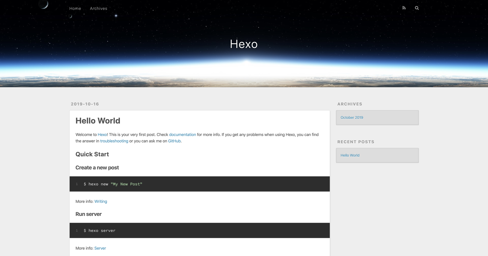
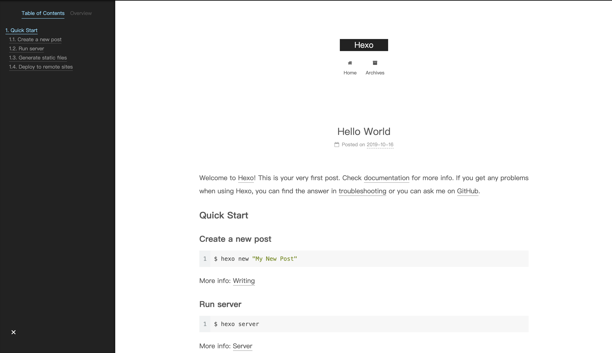
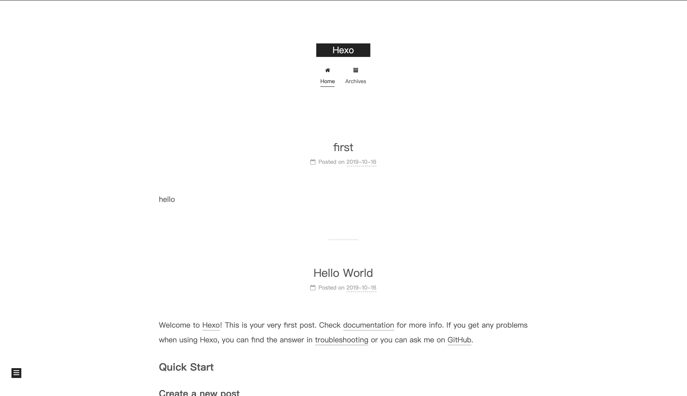
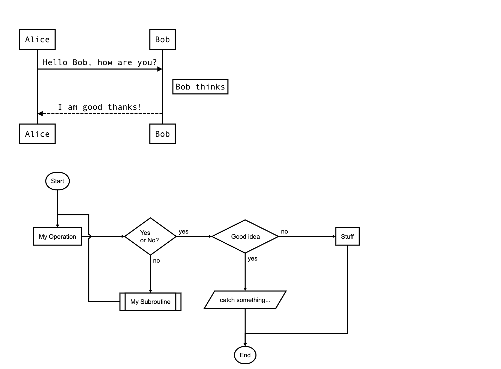
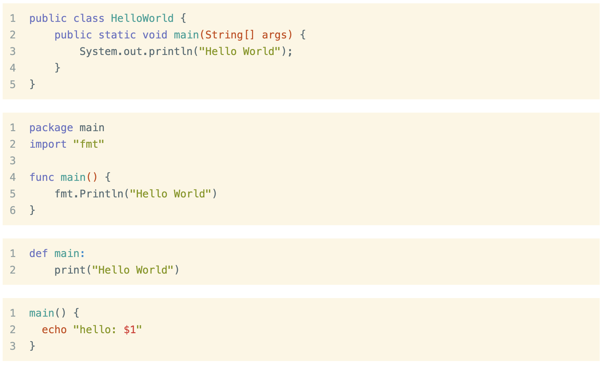
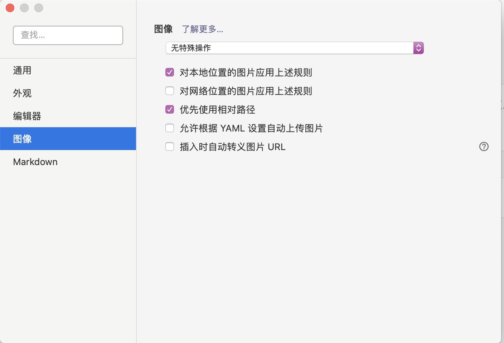
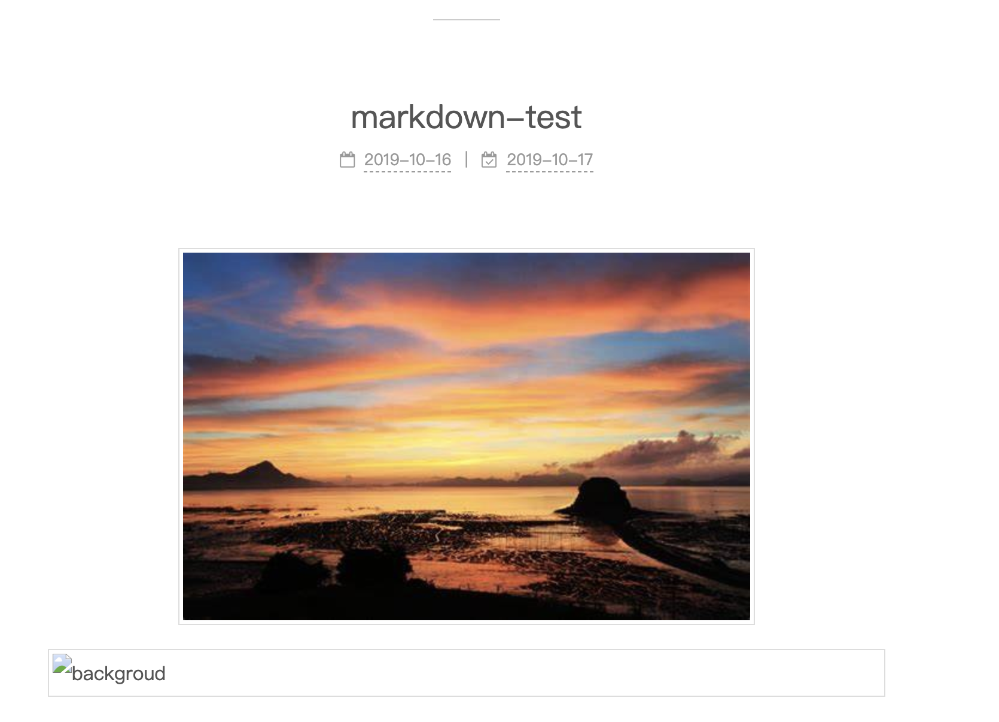
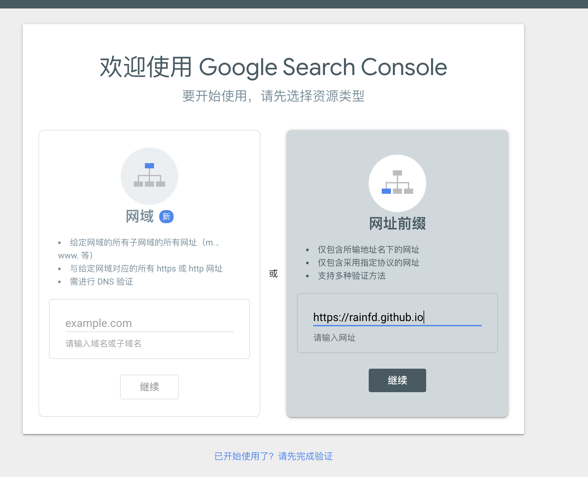
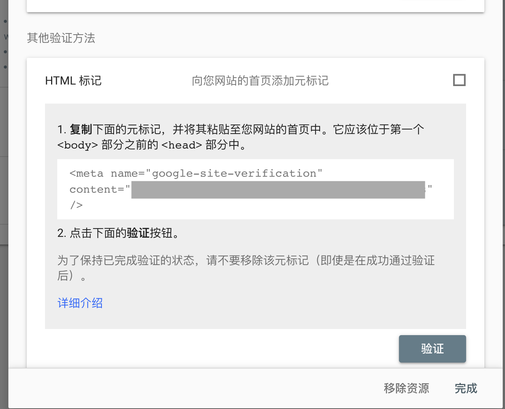

方案: Hexo +  GitHub Page +  [NexT](https://github.com/theme-next/hexo-theme-next.git)

<!--more-->

# Hexo

hexo是一个静态的博客网站，搭建比较简单。

    # brew install node
    # brew install yarn 后面安装部分插件需要
    npm install hexo-cli -g
    hexo init blog
    cd blog
    npm install
    hexo server # 简写hexo s

直接访问本地 http://lcoalhost:4000




简单介绍一下hexo的目录结构

    ├── _config.yml
    ├── node_modules
    ├── package-lock.json
    ├── package.json
    ├── scaffolds
    ├── source
    └── themes

- _config.yml 全站的配置
- scaffolds 模板，新建文章的模板就来自这里
- source 存放原始的文章、图片等
- themes 样式主题


# Next主题

    cd blog
    git clone https://github.com/theme-next/hexo-theme-next themes/next

修改 blog/_config.yml

    #theme: landspace
    theme: next

重新启动

    hexo g
    hexo s

首页


文章页面



其中Next主题的目录结构如下：

    ├── LICENSE.md
    ├── README.md
    ├── _config.yml
    ├── crowdin.yml
    ├── docs
    ├── gulpfile.js
    ├── languages
    ├── layout
    ├── package.json
    ├── scripts
    └── source

- _config.yml 主题配置
- languages 多语言支持
- layout 布局目录，存放模板文件，支持多种模板引擎EJS,Swig等等
- scripts Hexo在初始化的时候会自动加载目录内的js脚本。
- source 存放原始的素材，例如CSS和JS文件

## 部署

为了简化部署这里直接使用hexo-deplyer-git插件，先直接安装插件

    npm install hexo-deployer-git --save

在github上创建新的仓库，命名为<username>.github.io

再修改根目录下的_config.yaml

    deploy:
      type: git
      repo: https://github.com/<username>
      # example, https://github.com/xxxx.github.io
      branch: master

构建推送

    $ hexo deploy

推送完等一小段时间后，就可以同构<username>.github.io来访问你的博客

我自己使用的是Travis CI 自动构建的方式，详见[https://rainfd.github.io/2019/10/20/Travis-CI-Build-GithubPage/](https://rainfd.github.io/2019/10/20/Travis-CI-Build-GithubPage/)。


### 尝试开始写作

1. 创建标题为first的文章

```
$ hexo new first
INFO  Created: ~/blog/source/_posts/first.md
```

2. 编辑该文章，添加内容。

```
$ vi source/_posts/first.md
---
title: first2
date: 2019-10-16 19:42:43
tags:
---
hello
```

可以看到文章的开头几个字段是描述这篇文章的基本信息。

3. 编辑后构建更新(后面会的修改会默认执行这步)

```
$ hexo clean && hexo g && hexo s
```



虽然现在可以直接开始写作了，但是现在页面和功能有些简陋。接下来就按照前面提到的需求逐一实现。


## 布局

### 首页

**_config.yml**

```yaml
# Site
title: RainFD's Blog
subtitle: Walking in the Rain
description:
keywords:
author: RainFD
language: zh-CN
timezone: Asia/Shanghai

# URL
## If your site is put in a subdirectory, set url as 'http://yoursite.com/child' and root as '/child/'
url: https://rainfd.github.io
```

#### 侧边栏

**next/_config.yml**

```
avatar: # 设置侧边栏头像
  # support gif/png/jpg
  # images: http://xx 
  images: /images/sc2.png # 将图片放到主题的source/images下
```

###   文章简介

NexT首页默认显示文章的所有内容。如果想要只显示简介，可以在文章中设置`<!--more-->`，这样首页只会显示在这个标签之前的内容了。为了方便使用，可以将其写入导模板中。

**blog/scaffolds/post.md**

```
---
title: {{ title }}
date: {{ date }}
tags:
categories:
---

<!--more-->
```


####  侧边栏

NexT主题已经默认添加了一个侧边栏，自动缩略在左下角。


### 分类标签页


[https://github.com/iissnan/hexo-theme-next/wiki/%E5%88%9B%E5%BB%BA%E5%88%86%E7%B1%BB%E9%A1%B5%E9%9D%A2](https://github.com/iissnan/hexo-theme-next/wiki/创建分类页面)


## 第三方支持


### 数学公式

要使用公式，要先替换掉原来有问题的默认引擎

    npm uninstall hexo-renderer-marked
    npm install or hexo-renderer-kramed

NexT支持两种数学公式渲染引擎 MathJax和Katex

- MathJax，默认选项。功能最全，Typora支持；
- Katex，渲染速度较快，不依赖于Javascript。

这里直接选择MathJax

修改配置NexT配置_config.yml

    math:
    	enable: true
      ...
    	mathjax:
    		enable: true

在文章中添加以下内容进行测试

    the famous matter-energy equation $\eqref{eq1}$ proposed by Einstein ...
    
    $$\begin{equation}
    e=mc^2
    \end{equation}\label{eq1}$$
    
    $$
    \begin{equation}
    \begin{aligned}
    a &= b + c \\
      &= d + e + f + g \\
      &= h + i
    \end{aligned}
    \end{equation}\label{eq2}
    $$



### 代码高亮

编辑NexT的_config.yml

    codeblock:
      # normal | night eighties | night blue | night bright | solarized | solarized dark | galactic
      highlight_theme: solarized

测试代码

    ```java
    public class HelloWorld {
        public static void main(String[] args) {
            System.out.println("Hello World");
        }
    }
    ```
    
    ```golang
    package main
    import "fmt"
    
    func main() {
        fmt.Println("Hello World")
    }
    ```
    
    ```python
    def main:
        print("Hello World")
    ```
    
    ```bash
    main() {
      echo "hello: $1"
    }
    ```



### 文章图片支持

Hexo3对图片的支持有两个改进，一个支持post_asset_folder,一个是asset_img。

修改blog目录的_config.yml

    post_asset_folder: true

将这个选项改为true后，每次使用hexo new title 新建文章后，hexo会在文章存放的目录创建一个同名的目录。

    ➜  blog hexo new test
    INFO  Created: ~/blog/source/_posts/test.md
    ➜  blog ll source/_posts
    total 24
    -rw-r--r--  1 rainfd  staff   826B 10 16 15:24 hello-world.md
    -rw-r--r--  1 rainfd  staff   698B 10 16 21:42 markdown-test.md
    drwxr-xr-x  2 rainfd  staff    64B 10 17 05:18 test
    -rw-r--r--  1 rainfd  staff    52B 10 17 05:18 test.md

我本地要使用Typora编辑文章，但Hexo(xx.png)与Typora(title/xx.png)正确识别的路径经常会不一致。

1. 安装插件

```
npm install --save-dev hexo-typora-image
```

2. 修改博客中的文章模板 **scaffolds/post.md**，添加typora-copy-images-to字段。

```
$ cat scaffolds/post.md
---
title: {{ title }}
date: {{ date }}
tags:
categories:
typora-copy-images-to: {{ titile }}
...
```

3. 修改Typora图像设置



最终的效果是，讲图片拖入Typora后，图片会自动复制到文章目录，在源文件的路径是 ``，在渲染时经过hexo-typora-image插件的修改变成 ``，能正常在Hexo上显示。

这种使用方式存在一个问题就是这种相对路径引用在首页无法显示，要使该图片在首页显示正常，需要使用之前提到的asset_img。

    



上图中正常显示的就是使用了asset_img的图片。

### 流程图支持

Typora默认支持Sequence, Flowchart和Mermaid

个人常用Sequence和Flowchart，更为复杂的图用其他画图工具完成。

- [https://github.com/bubkoo/hexo-filter-sequence](https://github.com/bubkoo/hexo-filter-sequence)
- [https://github.com/bubkoo/hexo-filter-flowchart](https://github.com/bubkoo/hexo-filter-flowchart)

Sequence和Flowchart直接在blog根目录安装插件就可以使用

    npm install --save hexo-filter-sequence
    npm install --save hexo-filter-flowchart

测试内容

    ```sequence
    Alice->Bob: Hello Bob, how are you?
    Note right of Bob: Bob thinks
    Bob-->Alice: I am good thanks!
    ```
    
    ```flow
    st=>start: Start|past:>http://www.google.com[blank]
    e=>end: End:>http://www.google.com
    op1=>operation: My Operation|past
    op2=>operation: Stuff|current
    sub1=>subroutine: My Subroutine|invalid
    cond=>condition: Yes
    or No?|approved:>http://www.google.com
    c2=>condition: Good idea|rejected
    io=>inputoutput: catch something...|request
    
    st->op1(right)->cond
    cond(yes, right)->c2
    cond(no)->sub1(left)->op1
    c2(yes)->io->e
    c2(no)->op2->e
    ```


### 网站收录

收录到各个搜索引擎。NexT主题已经设置了相关字段，只需要到各个网站注册就可以。

    # Google Webmaster tools verification.
    # See: https://www.google.com/webmasters
    google_site_verification:
    # 请注意：DNS 更改可能要过一段时间才会生效。如果 Search Console 未能立即发现相应记录，请等待 1 天，然后重新尝试验证
    
    # Bing Webmaster tools verification.
    # See: https://www.bing.com/webmaster
    bing_site_verification:
    
    # Yandex Webmaster tools verification.
    # See: https://webmaster.yandex.ru
    yandex_site_verification:
    
    # Baidu Webmaster tools verification.
    # See: https://ziyuan.baidu.com/site
    baidu_site_verification:

### 访问统计

#### Google Analytics

https://www.google.com/webmasters/

进入后选择





将content里面的id填入到主题的 google_site_verification 字段。

#### 百度统计

登录 http://tongji.baidu.com/ 注册，生成网站统计代码
```javascript
<script>
var _hmt = _hmt || [];
(function() {
  var hm = document.createElement("script");
  hm.src = "https://hm.baidu.com/hm.js?appid";
  var s = document.getElementsByTagName("script")[0];
  s.parentNode.insertBefore(hm, s);
})();
</script>
```

使用代码中的appid填入到 _config.yml 的 badu_analytics 字段中。等待一段20分钟后就可以在百度统计看到相关数据。


#### 不蒜子

在文章页面统计访问次数

```
busuanzi_count:
  enable: false
  total_visitors: true
  total_visitors_icon: user
  total_views: true
  total_views_icon: eye
  post_views: true
  post_views_icon: eye
```


### 搜索

#### Algolia

NexT设置教程https://github.com/theme-next/hexo-theme-next/blob/master/docs/zh-CN/ALGOLIA-SEARCH.md

直接按照教程中的流程设置，但生成索引的时候，使用的key要改为api key。

```
# export HEXO_ALGOLIA_INDEXING_KEY=Search-Only API key
$ export HEXO_ALGOLIA_INDEXING_KEY=API key
$ hexo algolia
```

假设你是使用Travis CI进行部署的，还需要将这个key设置为环境变量，在构建脚本 .travis.yml 中添加

```
script:
  - hexo generate
  - hexo algolia # build index
deploy:
```


### 评论

