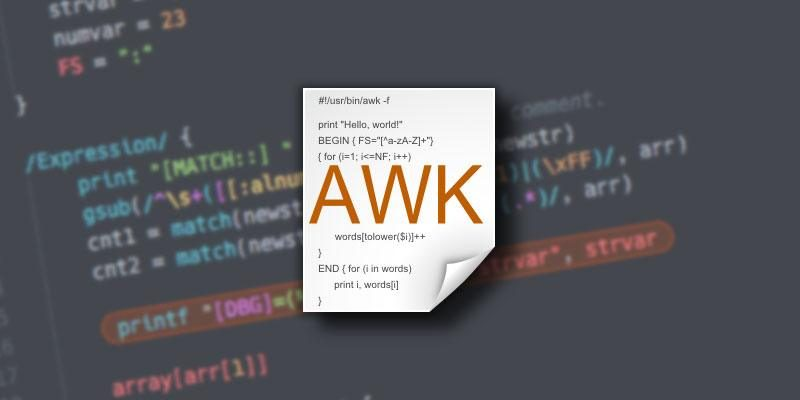
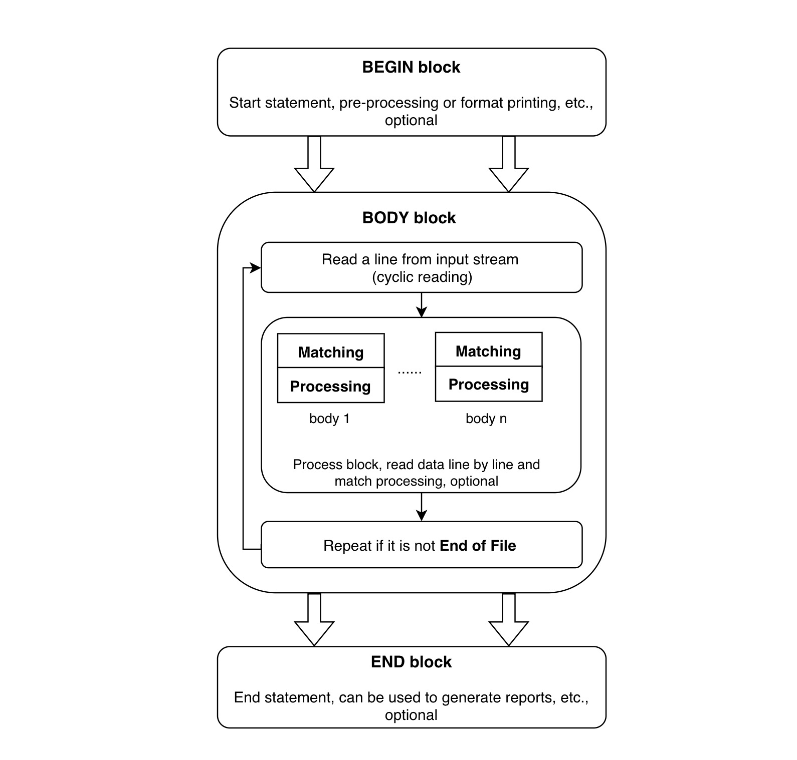

Awk tutorial and practical examples.

<!--  -->

*This article is a partial translation of [Awk command tutorial in linux/unix with examples and use cases](https://www.linuxcommands.site/linux-text-processing-commands/linux-awk-command/awk-syntax/)*
<!--more-->

---

## **What is AWK?**

**AWK** is a text processing tool.

The simplest and most common use case is extracting the Nth column of text, for example:

```plain
# file data
1 Tony 18 
2 Jenny 20
```

```bash
$ awk '{ print $2 }' data
Tony
Jenny
```

**AWK** is named after the initials of its three creators: Alfred Aho, Peter Weinberger, and Brian Kernighan.

**AWK** has a built-in scripting language to help process data. This language supports variables, functions, user-defined functions, and many logical operators. With this scripting language, awk can handle a wide range of practical tasks.

## **Using AWK**

### Basic Format

`awk [options] 'pattern{ commands } file'`

### Full Format

```bash
awk [-F|-f|-v] '
BEGIN{ commands }  
pattern{ commands }  
END{ commands }' file
```

### Options

- `-F`: specify the field separator

  `-F'[:#|]'`: multiple separators can be defined

- `-f`: specify a script file

- `-v`: define a variable `var=value`

### Syntax

`pattern { action }`

Actions are similar to other scripting languages, including basic keywords like `if`, `for`, `while`, etc.

```awk

              if( expression ) statement [ else statement ]
              while( expression ) statement
              for( expression ; expression ; expression ) statement
              for( var in array ) statement
              do statement while( expression )
              break
              continue
              { [ statement ... ] }
              expression              # commonly var = expression
              print [ expression-list ] [ > expression ]
              printf format [ , expression-list ] [ > expression ]
              return [ expression ]
              next                    # skip remaining patterns on this input line
              nextfile                # skip rest of this file, open next, start at top
              delete array[ expression ]# delete an array element
              delete array            # delete all elements of array
              exit [ expression ]     # exit immediately; status is expression
```

#### User-Defined Functions

Awk supports user-defined functions, typically placed before the `BEGIN` block.

`function foo(a, b, c) { ...; return x }`

### AWK Execution Flow

An awk script typically consists of three parts: **BEGIN**, **BODY**, and **END**.

All three parts are optional.



- Step 1: Execute commands in the `BEGIN` block.
- Step 2: Read one line at a time from stdin or a file, execute matching commands, and repeat until input is exhausted.
- Step 3: When the file ends, execute commands in the `END` block.

**BEGIN** runs before any input is read. It's typically used to initialize variables and print output headers or other auxiliary information.

**END** runs after all input has been read. It's used to print summary or statistical information.

**BODY** contains the main processing commands. If an awk command has no BODY section, it defaults to `{print}` — outputting each record in its entirety.

### Variables

- `$0`: the entire line
- `$1`: the 1st field of each line
- `NF`: number of fields
- `NR`: current line number
- `FNR`: similar to `NR`, but resets per file when processing multiple files
- `FS`: field separator
- `RS`: record separator (default: one line per record)
- `ARGC`: argument count
- `ARGV`: argument array
- `ENVIRON`: environment variable array
- `OFS`: output field separator (default: space)
- `ORS`: output record separator (default: newline)

### Operators

```plain
+ - * / % ^ ! ++ -- += -= *= /= %= ^= > >= < <= == != ?: 
```

- `~`: matches (contains), fuzzy comparison
- `!~`: does not match (does not contain), fuzzy comparison
- `==`: equals, exact comparison
- `!=`: not equal, exact comparison

The difference between these matching operators:

- `~` checks whether a string contains a substring
- `==` checks whether two strings are exactly identical

### Arrays

`array[index]=value`

Arrays don't need to be declared before use, and the index can be any string — similar to a dictionary. If the index is a string, use double quotes.

Awk arrays don't support multi-dimensional arrays, but you can simulate them via the index. Note that double quotes aren't needed here:

`array[1,1]=0`

### Example

The following example shows the original file locations of applications under `/usr/bin`:

```bash
$ ls -l /usr/bin | awk '
    BEGIN {
        print "Directory Report"
        print "================"
    }

    NF > 9 {
        print $9, "is a symbolic link to", $NF
    }

    END {
        print "============="
        print "End Of Report"
    }
'
```

Here, `NF > 9` means only lines with more than 9 fields will execute the BODY commands.

### Built-in Functions

Arithmetic functions: `exp`, `log`, `sqrt`, `sin`, `cos`, `atan2`

Other built-in functions:

- `rand`: get a random decimal between 0 and 1
- `srand`: set the random seed
- `int`: truncate to the integer part
- `substr(string, position, length)` / `substr(string, position)`: extract a substring
- `index(s, t)`: position of character `t`, returns 0 if not found
- `match(s, r)`: position of the match for regex `r`
- `split(source, des, delimiter)`: split a string by delimiter into array `des`
- `sub(r, t, s)`: replace the first match of `r` with `t`, `s` defaults to `$0`
- `gsub(r, t, s)`: like `sub`, but replaces all matches
- `sprintf(fmt, expr, ...)`: format data into a string
- `system(cmd)`: execute a command and return the status code
- `tolower(str)`: return the lowercase version of a string
- `toupper(str)`: return the uppercase version of a string

## Practical Examples

### Group By Count

We usually use SQL's `GROUP BY` + `COUNT` to aggregate and count data. Awk can do this just as easily.

Sample data:

````text
id,name,sex
1,Tony,male
2,Jenny,female
3,Jack,male
````

Count by gender:

```bash
awk -F, '
BEGIN { 
  print "---------"
  print "sex total"
}

NR > 1 {
  counter[$3]++
}

END {
  print "male: ", counter["male"];
  print "female: ", counter["female"]
}' data
```

### Matching Text Within a Range

Using the data above as an example, suppose this data is embedded in a much longer text:

```plain
...
UserData
id,name,sex
xxx
final: xxx
...
```

If the data is bounded by clear markers, we can use range pattern matching:

```plain
/UserData/, /final/ { counter[$3]++ }
```
