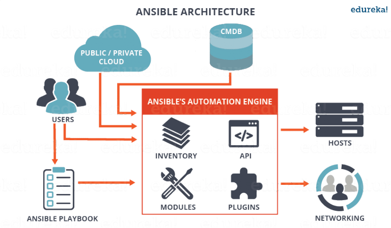

What is Ansible? What can Ansible do?

<!--more-->

---

## What Is Ansible

Ansible is a configuration management and IT automation tool. Simply put, it's a tool that automates scripts.

Imagine having to manually deploy a dozen services across dozens of machines, with the occasional failed upgrade and rollback thrown in — that would be a nightmare. This is where automation tools like Puppet, Chef, and Ansible become an ops person's lifeline.

## Why Ansible

1. Agentless — just set up SSH keys and you're ready to go.
2. Large user base in China — most DevOps job listings mention Ansible.
3. Extensive community playbooks — you can find pre-built playbooks for common software installations online.
4. Simple — not many concepts to learn, easy to pick up.

## Ansible Architecture



This is an Ansible architecture diagram I found online. From the diagram, you can see that Ansible's core components are Inventory, Modules, and Plugins. Users invoke these components through `ansible-playbook` or other APIs to run automation tasks on target hosts.

---

## Installing Ansible

On Linux, just use pip: `pip install ansible`.

*Ansible has known issues on Windows and macOS — best to avoid those platforms.*

After installation, verify with `ansible --version`.

---

## Using Ansible

For everyday use, you only need to understand these core concepts:

- host inventory
- ansible CLI command
- module
- playbook

To quote the Ansible docs:

> If Ansible modules are the tools in your workshop, playbooks are your instruction manuals, and your inventory of hosts are your raw material.

---

### Host Inventory

Ansible typically connects to many hosts, and the inventory is the file that declares those hosts.

It can be in INI format:

```ini
mail.example.com

[webservers]
foo.example.com
bar.example.com

[dbservers]
one.example.com
two.example.com
three.example.com
```

Or YAML format:

```yaml
all:
  hosts:
    mail.example.com:
  children:
    webservers:
      hosts:
        foo.example.com:
        bar.example.com:
    dbservers:
      hosts:
        one.example.com:
        two.example.com:
        three.example.com:
```

> Ansible configs generally support both formats.

Notice the example above also supports grouping — using a name to represent a group of hosts. Beyond declaring IPs/hostnames, you can also specify other parameters:

`jumper ansible_port=5555 ansible_user=root`

---

### Ansible CLI Command && Module

You've probably seen people highlight that Ansible is "agentless" — so how does that actually work?

It's really simple: SSH. As long as you add the control host's key to the target host's `authorized_keys`, Ansible can control it over SSH.

For testing, let's add the local host to the inventory:

```ini
localhost
```

Save this as `hosts` (Ansible's default inventory filename is `hosts`), then add the host's public key to the local `authorized_keys`. Now run:

`ansible -i hosts all -m ping`

If everything works, you'll see output like this, indicating a successful connection to all hosts in the inventory:

```bash
localhost | SUCCESS => {
    "changed": false,
    "ping": "pong"
}
```

Here's what the command `ansible -i hosts all -m ping` means:

- `ansible` is the CLI tool, used for testing or running simple tasks on hosts. For more complex or numerous tasks, you'll need `ansible-playbook`, which I'll cover below.
- `-i hosts` specifies which inventory file to use. The default is `~/.ansible/hosts`. Besides using the default or specifying with `-i`, you can also set an environment variable to change the file path — see the [official docs][1] for details.
- `all` means select all hosts. If you set up groups in the inventory, like `webservers` in the example above, changing this to `webservers` would only connect to that group of hosts.
- `-m ping` means use the ping module. Modules are tools Ansible provides to simplify operations. Common ones include `shell` (run shell commands), `copy` (copy files to target hosts), `file` (create files, modify file permissions), and so on. The most commonly used is the `ping` module, which tests whether the hosts in the inventory are reachable.

---

### Playbook

"Playbook" literally means a script for a play. In Ansible, a playbook combines a series of operations to achieve reusability. One reason Ansible is so popular is how convenient playbooks are — the official team and many developers have written reusable playbooks for installing common software. Users just need to download a playbook and run it.

Playbooks use YAML syntax. A typical playbook directory structure looks like this:

```plain
├── defaults
│   └── main.yml
├── files
├── handlers
│   └── main.yml
├── tasks
│   └── main.yml
├── templates
│   ├── example.conf.j2
└── vars
    └── main.yml
```

Let's start with `tasks/main.yml`.

#### tasks

`main.yml` is usually the entry point — you can do all the work here, or import other task files.

Here's an example playbook for installing a Django application, covering directory initialization, code copying, and starting the app:

```plain
---
# install django
- name: install django
  shell: pip install "django{{ django_version }}"

# init directory
- name: init directory
  file:
    path: "{{ project_path }}"
    state: directory
  notify:
    - restart example

# copy code to target directory
- name: copy code to target directory
  copy:
    src: mysite
    dest: "{{ root_path }}"

# generate config file
- name: template supervisor file
  template:
    src: example.j2
    dest: "{{ supervisor_app_path }}"
  notify:
    # reload supervisor config
    - reread example
    # restart the application
    - restart example
```

As you can see, each step is a module. In a playbook, you decompose your manual operations into small tasks and achieve your goals through modules.

---

#### vars and defaults

Both folders store variables:

```plain
---
# vars/main.yml
project_user: root
root_path: /tmp
project_path: /tmp/mysite
log_path: /tmp/mysite/log
program_name: example
supervisor_app_path: /etc/supervisor/conf.d/example.conf
---
# default/main.yml
django_version: "<2"
```

Variables declared here can be referenced elsewhere using `{{ vars }}` syntax. The difference between `vars` and `defaults` is exactly what the names suggest: variables in `defaults` typically stay the same once set, while those in `vars` often change depending on requirements and environment.

---

#### templates

Templates are commonly used to generate configuration files for various software. They use `Jinja2` syntax for file generation — the `{{ }}` variable interpolation syntax comes from `Jinja2`. By combining them with variables from `vars` and `defaults`, and using the `template` module in tasks, you can quickly generate new config files. In our example, this is used to generate the supervisor configuration:

```ini
[program:{{ program_name }}]
command=python manage.py runserver
autostart=true ; supervisord starts this automatically on daemon startup
autorestart=true ; supervisord restarts this automatically on daemon restart
redirect_stderr=true ; redirect stderr to stdout
user={{ project_user }}
directory={{ project_path }} ; cd to the app directory
stdout_logfile={{ log_path }}
```

---

#### files

Besides config files, there are usually static files (like verification keys, environment variable files) that need to be copied to target hosts. The `files` directory works with the `copy` module to send these files:

```yaml
- name: copy code to target directory
  copy:
    src: mysite
    dest: "{{ root_path }}"
```

Of course, the more common way to download code is through git — Ansible provides a `git` module for that.

#### handlers

Handlers typically manage service start/stop operations:

```yaml
---
- name: reread example
  supervisorctl:
    name: example
    state: present

- name: start example
  supervisorctl:
    name: example
    state: started

- name: restart example
  supervisorctl:
    name: example
    state: restarted

- name: delete example
  supervisorctl:
    name: example
    state: present
```

So how are handlers called? Notice the `notify` keyword in the tasks above.

Let's pause here to introduce a few concepts about how Ansible handles tasks. When Ansible runs each small task (corresponding to one module in `tasks/main.yml`), it outputs the task's completion status.

There are two statuses: `success` and `failed`. Normally, if a task results in `failed`, the entire playbook halts. `success` also splits into two: `changed=true` and `changed=false`. `changed=true` means the task's execution differed from its previous run — for example, the file copied by the `copy` module is different, or the content generated by `templates` changed, and so on.

Back to `notify` — its content is a list of handlers. During playbook execution, `notify` watches for the `changed` status. Only when a task actually changes something will the handlers in `notify` execute. This property makes it a natural fit for service start/stop operations.

In the example above, the service only restarts when the code changes or the supervisor config changes. If you used a plain module in `tasks` for service start/stop, it would restart the service on every run — even when nothing has changed — which is often inappropriate.

I've walked through all the common playbook directory contents, but did you notice the first task in the example `tasks/main.yml`? It uses the `shell` module to install Django: `pip install django`. Have you thought about the fact that most machines don't have `pip` pre-installed? Let alone `supervisor`, which we use to run Django?

Do I need to add pip and supervisor installation steps here? Of course not. As I mentioned when introducing playbooks, you can easily find playbooks for installing them online. But how do you combine them with this Django deployment playbook?

### roles

This is where roles come in. Ansible introduces roles to differentiate between playbooks — similar to different actors reading different scripts, each with their own role to play.

Here's the directory structure after adding roles:

```plain
roles
├── example
│   ├── defaults
│   ├── files
│   ├── handlers
│   ├── hosts
│   ├── meta
│   ├── tasks
│   ├── templates
│   ├── tests
│   └── vars
├── geerlingguy.pip
└── geerlingguy.supervisor
```

Now we clearly need an entry point file to call both playbooks:

```yaml
---
# django.yml
- hosts: all
  roles:
    - geerlingguy.supervisor
    - geerlingguy.pip
    - django
```

Now you can call `ansible-playbook` to deploy your Django app:

`ansible-playbook -i hosts django.yml`

---

## Summary

Real-world ops tasks don't always match the steps in the example above, so before writing a playbook, you generally need to break the task down first. Taking the Django deployment example again, the task can be decomposed into:

1. Install dependencies (pip, supervisor, Django)
2. Initialize machine directories
3. Copy code to target host
4. Start/restart the service

The dependency installation part can be delegated to other playbooks. Service start/stop is handled by handlers. Directory paths, service parameters, Django version, etc., go into variables in `defaults` and `vars`. Code can be placed in `files` for easy copying. The full task flow is written in `tasks`.

Once you've done the decomposition, writing the playbook is just a matter of time.

[1]: <https://docs.ansible.com/ansible/latest/index.html>
