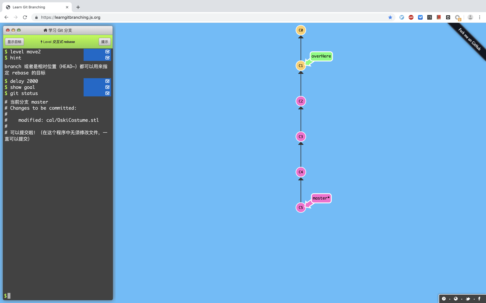
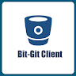
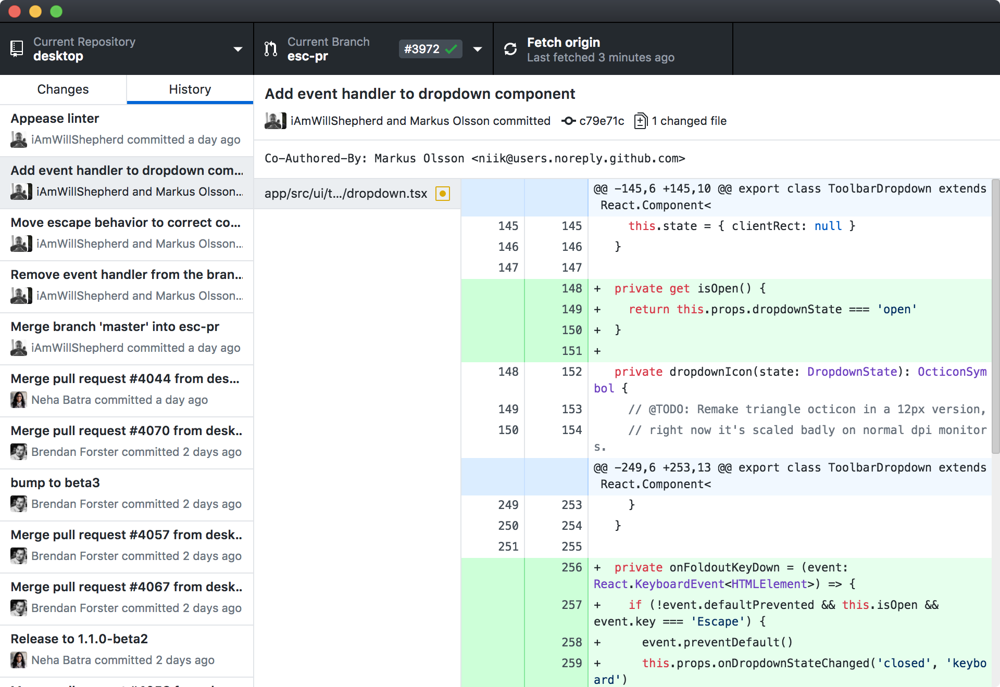
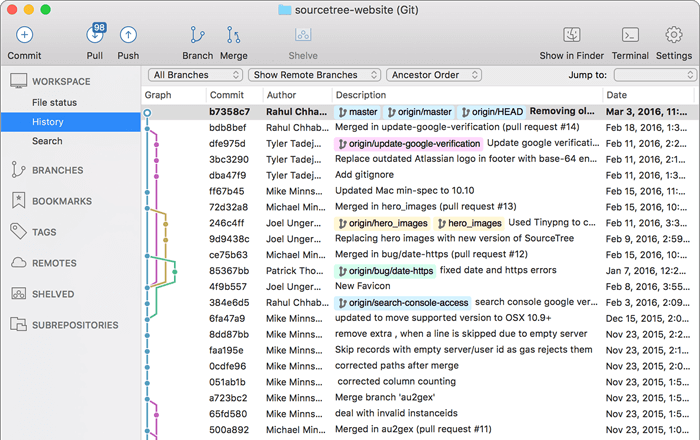
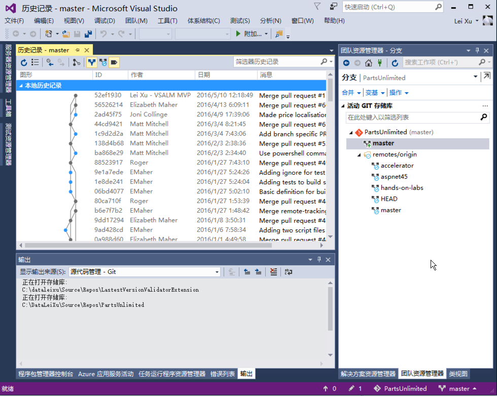
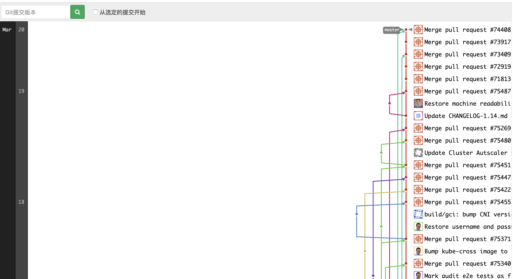

There are way too many Git articles online already, so I won't waste time covering the basics. Instead, I'll recommend some resources and share a few less common but genuinely useful techniques.

<!--more-->

---

## Interactive Git Tutorial

Link: https://learngitbranching.js.org/



This tutorial covers common commands like `git fetch`, `git pull`, `git push`, `git revert`, `git reset`, and `git checkout`. Through graphics and animations, it visualizes branch tree changes as you work through each command. The whole tutorial is vivid and intuitive — highly recommended for beginners.

## Git Workflows

Link: <http://www.ruanyifeng.com/blog/2015/12/git-workflow.html>


It introduces three commonly used Git workflows:

- Git flow
- Github flow
- Gitlab flow

This blog has plenty of Git tutorials alongside many other high-quality articles — well worth a read.

## Git Servers

Beyond the most popular option, GitHub, there are other Git servers:

- Gitlab
- Gogs
- Bitbucket
- Gitee (码云)

### Github


GitHub's basic service is free, which also means your repositories are public. In January 2019, GitHub announced free private repositories, but they cap at 3 collaborators — not enough for companies or even small teams.

### Gitlab


If you want to name the most feature-packed Git server, it's Gitlab without question. Beyond building on GitHub's feature set with tons of practical additions, Gitlab has recently embedded CI/CD services into its platform, deeply integrating with Kubernetes — almost like it wants to compete with Jenkins in the CI space.

The downside is obvious: advanced features are paid, and it's seriously "heavy" — it eats up a lot of memory.

### Gogs


A lightweight Git server written in Go, providing the essentials: Git, Wiki, and Issues. People have run Gogs on a Raspberry Pi, which tells you just how "light" it is. If your team isn't large, Gogs is a great choice.

### Bitbucket



Another component from the Atlassian family, it integrates with Jira and Trello (a Kanban tool widely used internationally). Not many people in China use it.

### Gitee (码云)


The go-to Git service in China, with many Gitlab-like features. If you're worried about GitHub being blocked, it's a decent alternative.

Gitee's main user base is traditional Chinese companies — they find it cumbersome to purchase international Git servers, and Gitee's localization is genuinely good, with integrations for WeChat and DingTalk.

## Issue, Wiki, Kanban

The most common yet most overlooked features: Issue tracking, Wiki documentation.

Although we often browse issues on GitHub, I've rarely seen teams use Issues for bug tracking across several companies I've worked at.

Many open-source projects maintain dedicated documentation sites, but running a website just for docs is too much overhead. Using the Wiki built into your Git service is both convenient and hassle-free.

Kanban — another project management component. Throw your development progress onto a board.


Beyond these, Git servers like GitHub and Gitlab bundle quite a few project management features. If your team isn't keen on maintaining a separate project management tool, give these Git-integrated features a look.

## Project Pages / Personal Blog

[GitHub Pages](https://pages.github.com/) was originally meant for open-source project landing pages, but it's evolved into a full-fledged blog hosting service. Beyond configuring your blog directly on GitHub Pages, you can use static site generators like [Hexo](https://hexo.io/) to build and push your blog to GitHub. This blog is built with Hexo. Detailed setup instructions can be found in Hexo's documentation.

## Git GUI Tools

As your project accumulates more branches, merging branches and editing commit history from the command line gets pretty abstract. Fortunately, there are many GUI tools to simplify things.

### GitHub for Desktop

GitHub's official Git GUI.



#### SourceTree



Another Atlassian product, but unlike its siblings, SourceTree is arguably the cleanest and most user-friendly tool in its category.

### IDE Integration



Many IDEs come with built-in Git plugins.

### Gitlab Graph



If you're on Gitlab, you can view the full branch history directly on the project page.

## Rewriting Git Commit History

`git filter-branch`

`filter-branch` lets you batch-modify historical commits.

Example 1: Remove all historical key files to prevent secret leaks

```bash
git filter-branch --tree-filter 'rm -f key' HEAD
```

Example 2: Modify commit messages — convert to uppercase

```bash
git filter-branch -f --msg-filter \
'cat sed "s/update/UPDATE/g"' \
--tag-name-filter cat -- --all
```
