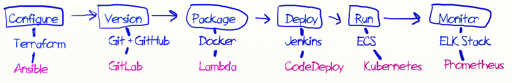
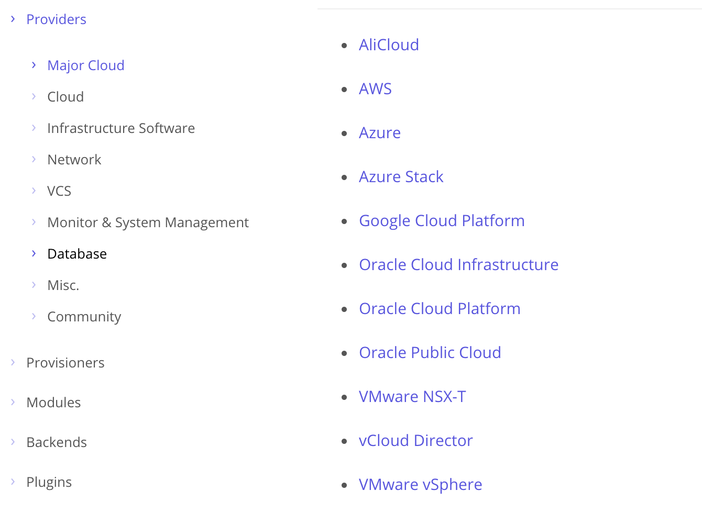
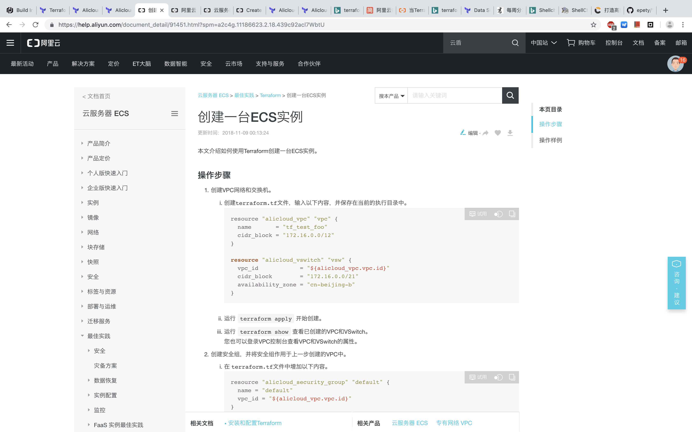
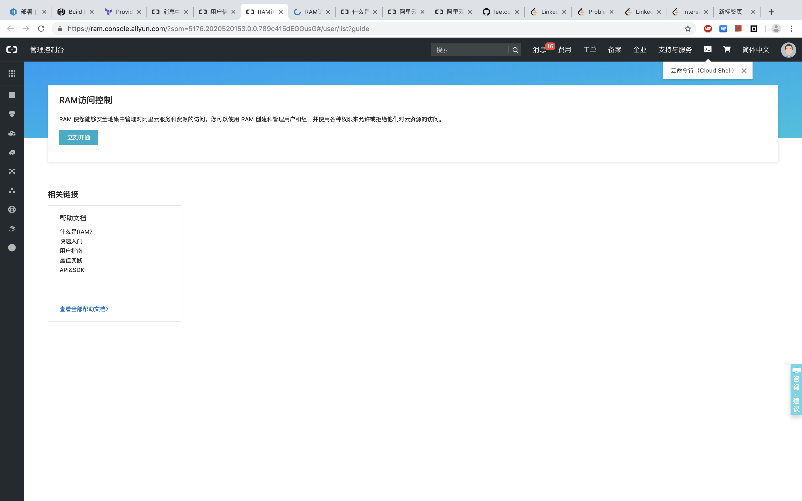
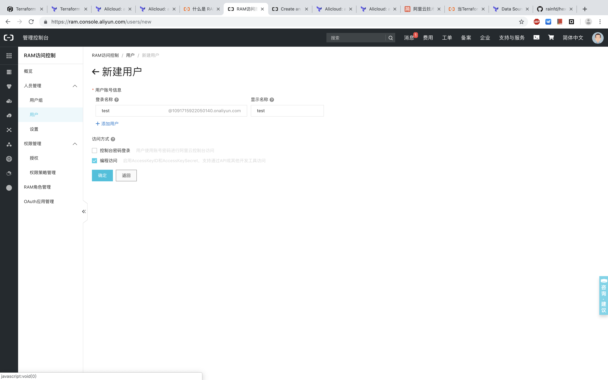
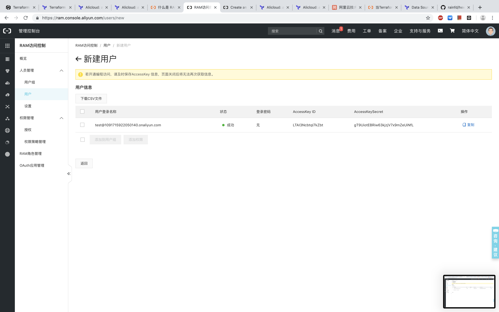
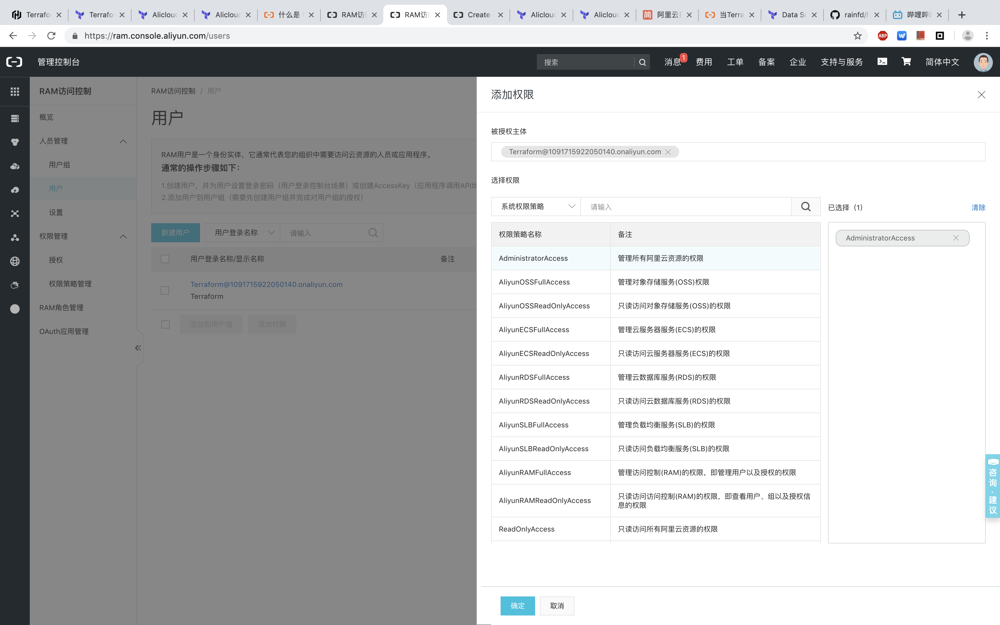
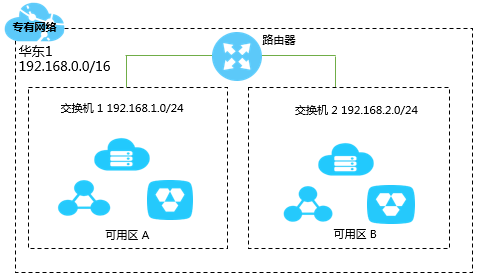
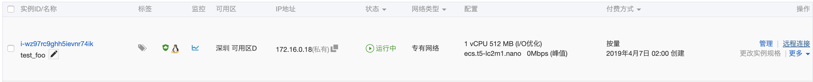

In the article [How To Become a DevOps Engineer In Six Months or Less](https://medium.com/@devfire/how-to-become-a-devops-engineer-in-six-months-or-less-366097df7737), the author lays out a DevOps learning path.

<!--  -->

This series of articles will follow this roadmap, tailored to the local context, introducing each stage and how to use these tools.

This article is the first one: the Terraform chapter.

<!--more-->

---

## Terraform

If you had to describe Terraform in one sentence, it would be: **INFRASTRUCTURE AS CODE**. If the concept of infrastructure feels unfamiliar, take a look at what Terraform considers infrastructure:



You can see AWS, Google Cloud Platform, Azure, and a host of other public cloud platforms along with some common PaaS platforms.

Imagine a scenario: your company needs you to deploy a business system on Alibaba Cloud. So you manually create resources one by one on Alibaba Cloud — LB, ECS, DB. Beyond these traditional architectural pieces, there's also network control (SDN), developer account management, and so on. A few days later, the company asks you to deploy another set in a different region. You sigh and go back to the console to click, click, click.

To solve exactly this kind of problem, the concept of **Infrastructure as Code** was introduced. Automating this process of initializing infrastructure through code and template languages is Terraform's primary function.

---

## Installation

Go to the [download page](https://www.terraform.io/downloads.html) and grab the binary archive for your platform. Unzip it and run it directly.

On macOS, you can use Homebrew: `brew install terraform`

---

## Tutorial (Aliyun)

Click [Learn](https://learn.hashicorp.com/terraform/) on Terraform's official homepage to access the official tutorial, though the examples use AWS and Azure. For convenience, I'll use Alibaba Cloud (Aliyun) here.

Aliyun's official documentation also covers creating resources with Terraform:

https://help.aliyun.com/document_detail/91451.html?spm=a2c4g.11186623.2.18.439c92acl7WbtU



Clicking the "Try It" button in the docs takes you to an online lab environment where you can run Terraform commands directly.

---

### Access Key

Before using Terraform to manage Aliyun resources, you'll need to create a user and generate an Access Key in the Aliyun console.
There are two ways to generate an Access Key:

1. Generate one directly — the key has full permissions across the entire account.
2. Create a RAM (Resource Access Management) user and grant permissions through authorization.

These correspond roughly to the root system administrator vs. a regular user on a Unix system. Using a RAM user is the recommended approach.

---

#### Creating a RAM User

You'll need to enable the RAM feature the first time you use it.



Create a Terraform RAM role (under Personnel Management → Users), and choose "Programmatic Access" to generate the Access Key.



Once created, the Access Key is generated automatically. Make sure to save it — you won't be able to retrieve it again after closing the dialog.



---

#### Adding Permissions

Since this is for testing, I'll just grant the highest permissions for convenience.



---

### Terraform Configuration

#### Initialization

Terraform uses `*.tf` configuration files to describe resources. When creating resources, Terraform recognizes all `.tf` files in the current directory.

*Aliyun Terraform configuration parameter reference: https://www.terraform.io/docs/providers/alicloud/index.html*

Now create an `example.tf` file:

```tf
# Configure the Alicloud Provider
provider "alicloud" {
  access_key = "<your access key>"
  secret_key = "<your secret key>"
  availability_zone = "cn-shenzhen-d"
}
```

This is where you set the Access Key you just created. Besides declaring it directly in the config file, you can also use environment variables:

```bash
➜  export ALICLOUD_ACCESS_KEY="LTAIUrZCw3********"
➜  export ALICLOUD_SECRET_KEY="zfwwWAMWIAiooj14GQ2*************"
➜  export ALICLOUD_REGION="cn-beijing"
```

Using environment variables lets you differentiate Aliyun accounts by system user.

Now run initialization — Terraform will automatically download the Aliyun provider plugin:

```bash
➜  aliyun terraform init

Initializing provider plugins...
- Checking for available provider plugins on https://releases.hashicorp.com...

Error installing provider "alicloud": Get https://releases.hashicorp.com/terraform-provider-alicloud/: EOF.

Terraform analyses the configuration and state and automatically downloads
plugins for the providers used. However, when attempting to download this
plugin an unexpected error occured.

This may be caused if for some reason Terraform is unable to reach the
plugin repository. The repository may be unreachable if access is blocked
by a firewall.

If automatic installation is not possible or desirable in your environment,
you may alternatively manually install plugins by downloading a suitable
distribution package and placing the plugin's executable file in the
following directory:
    terraform.d/plugins/darwin_amd64
```

If the download fails due to a firewall or other network issues, the error message directs you to download the plugin for your platform from the release page.

Plugin installation paths:

| Operating system   | User plugins directory          |
| ------------------ | ------------------------------- |
| Windows            | `%APPDATA%\terraform.d\plugins` |
| All other systems  | `~/.terraform.d/plugins`        |

```bash
# Windows:     %APPDATA%\terraform.d\plugins
# Linux & macOS: ~/.terraform.d/plugins
mkdir -p ~/.terraform.d/plugins/darwin_amd64
wget https://releases.hashicorp.com/terraform-provider-alicloud/1.34.0/terraform-provider-alicloud_1.34.0_darwin_amd64.zip
unzip terraform-provider-alicloud_1.34.0_darwin_amd64.zip
```

Re-run initialization — installation should succeed:

```bash
➜  terraform init

Initializing provider plugins...

The following providers do not have any version constraints in configuration,
so the latest version was installed.

To prevent automatic upgrades to new major versions that may contain breaking
changes, it is recommended to add version = "..." constraints to the
corresponding provider blocks in configuration, with the constraint strings
suggested below.


* provider.alicloud: version = "~> 1.34"

Terraform has been successfully initialized!

You may now begin working with Terraform. Try running "terraform plan" to see
any changes that are required for your infrastructure. All Terraform commands
should now work.

If you ever set or change modules or backend configuration for Terraform,
rerun this command to reinitialize your working directory. If you forget, other
commands will detect it and remind you to do so if necessary.
```

---

### Creating Resources

#### Resource Documentation

Terraform Aliyun plugin parameter documentation:

https://www.terraform.io/docs/providers/alicloud/r/instance.html

---

#### VPC and VSwitch

**VPC (Virtual Private Cloud)**: An isolated network environment built on Alibaba Cloud. VPCs are logically completely isolated from one another.

Each VPC has one router and at least one VSwitch (Virtual Switch). VSwitches connect different cloud resources, and routers connect different availability zones. This way, a single VPC can manage an entire independent network.



Now add VPC and VSwitch resources to `example.tf`:

```
#  data_type name
resource "alicloud_vpc" "vpc" {
  name       = "tf_test_foo"
  cidr_block = "172.16.0.0/12"
}

resource "alicloud_vswitch" "vsw" {
  vpc_id            = "${alicloud_vpc.vpc.id}"
  cidr_block        = "172.16.0.0/21"
  availability_zone = "cn-shenzhen-e"
}
```

Run `terraform apply` to create the resources:

```bash
➜  terraform apply
alicloud_vpc.vpc: Refreshing state... (ID: vpc-wz9974l8ryiwe8l9w582s)
alicloud_vswitch.vsw: Refreshing state... (ID: vsw-wz9knct0w23uwkzvq2s1n)

Apply complete! Resources: 0 added, 0 changed, 0 destroyed.
```

---

#### Security Groups and Security Rules

A security group controls network access to ECS instances. A security group contains multiple security rules. You can set up multiple security groups and combine them by configuring priorities.

```
resource "alicloud_security_group" "default" {
  name = "default"
  vpc_id = "${alicloud_vpc.vpc.id}"
}

resource "alicloud_security_group_rule" "allow_all_tcp" {
  type              = "ingress"                               # ingress (inbound) or egress (outbound).
                                                              # Outbound: ECS instances accessing other ECS instances on the internal network or resources on the public internet
                                                              # Inbound: other ECS instances on the internal network or public internet resources accessing the ECS instance
  ip_protocol       = "tcp"
  # nic_type          = "intranet"                              # internet connection
  policy            = "accept"                                # Note: the 'deny' policy silently drops packets without any response. If two security group rules are identical except for the policy, the 'deny' policy takes effect and 'accept' does not.
  port_range        = "1/65535"                               # from 1 to 65535
  priority          = 1                                       # the highest priority
  security_group_id = "${alicloud_security_group.default.id}"
  cidr_ip           = "0.0.0.0/0"                             # all ip address access
}
```

*In VPC security groups, the default value of `nic_type` is `intranet`, and only `intranet` is allowed — not `internet`. This means ECS instances inside a VPC cannot directly access the public internet.*

---

#### ECS Instance

Add an ECS instance:

*1. Make sure the desired instance type is available in your selected region.*

*2. Image reference: https://ecs.console.aliyun.com/#/image/region/cn-hangzhou/systemImageList*

```
resource "alicloud_instance" "instance" {
  # cn-beijing
  availability_zone = "cn-beijing-b"
  security_groups = ["${alicloud_security_group.default.*.id}"]

  # series III
  instance_type        = "ecs.n2.small"
  system_disk_category = "cloud_efficiency"
  image_id             = "ubuntu_140405_64_40G_cloudinit_20161115.vhd"
  instance_name        = "test_foo"
  vswitch_id = "${alicloud_vswitch.vsw.id}"
  internet_max_bandwidth_out = 10
  password = "<replace_with_your_password>"
}
```

A new account will generally fail to create an instance, complaining of insufficient balance:

```bash
Error: Error applying plan:

1 error(s) occurred:

* alicloud_instance.instance: 1 error(s) occurred:

* alicloud_instance.instance: Error creating Aliyun ecs instance: &errors.ServerError{httpStatus:403, requestId:"CA1B42FE-A5F9-4323-932F-B2C863C7AB16", hostId:"ecs-cn-hangzhou.aliyuncs.com", errorCode:"InvalidAccountStatus.NotEnoughBalance", recommend:"", message:"Your account does not have enough balance.", comment:""}

Terraform does not automatically rollback in the face of errors.
Instead, your Terraform state file has been partially updated with
any resources that successfully completed. Please address the error
above and apply again to incrementally change your infrastructure.
```

You need to top up your Aliyun account with at least 100 RMB (the default is pay-as-you-go billing, which requires at least 100 RMB in the account). Then retry:

```bash
Apply complete! Resources: 1 added, 0 changed, 0 destroyed.
```

Once you see the creation success message, log into the Aliyun console to see the instance:



Remember to run `terraform destroy` after testing to tear down all resources and avoid ongoing charges.

---

### Summary

At this point, we've used Terraform to create cloud resources. In real-world work, you'd combine this with more practical features — for example, Datasource, which lets you describe the requirements for an ECS instance and have Terraform automatically select the availability zone, image, instance type, and so on. But we've now covered Terraform's core functionality, so I'll leave it here.
