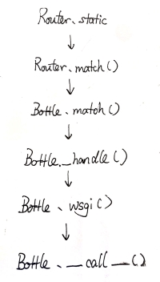

When a program receives a request, it looks up the corresponding view function based on the URL, which then generates the page to send back to the client. Different URLs map to different view functions — and the mechanism that handles this mapping is called routing. Routing has two parts:

1. Generating the URL mapping
2. Matching the correct view function for a request

This article analyzes both.

<!--more-->

---

# Generating URL Mappings

In the Bottle example from the previous post, we used the `@app.route` decorator to map the `/hello` path to the `hello` view function:

```python
@app.route('/hello')
def hello():
    return 'Hello World!'
```

Let's trace through `app.route` using `/hello` as our example.

```python
def route(self, path=None, method='GET', callback=None, name=None,
          apply=None, skip=None, **config):
    """
        :param callback: An optional shortcut to avoid the decorator
          syntax. ``route(..., callback=func)`` equals ``route(...)(func)``
    """
    if callable(path): path, callback = None, path
    plugins = makelist(apply)
    skiplist = makelist(skip)
    def decorator(callback):
        if isinstance(callback, basestring): callback = load(callback)
        for rule in makelist(path) or yieldroutes(callback):
            for verb in makelist(method):
                verb = verb.upper()
                route = Route(self, rule, verb, callback, name=name,
                              plugins=plugins, skiplist=skiplist, **config)
                self.add_route(route)
        return callback
    return decorator(callback) if callback else decorator
```

Note the docstring and the last line — this return pattern means we can also use `app.route('/hello', callback=hello)` to achieve the same result.

The `route` method packages our routing rule (`/hello`), the associated HTTP method (default `GET`), plugins, and other parameters into a `Route` object, then adds it to the `Router` instance via `Router.add()`.

`Router.add()` partial code:

```python
def add(self, rule, method, target, name=None):
    # do some something
    if is_static and not self.strict_order:
        self.static.setdefault(method, {})
        self.static[method][self.build(rule)] = (target, None)
        retun
    # dynamic path parse
```

Inside the `Router`, it maintains two dictionaries: `static` and `dyna_route`, for static routes and dynamic routes respectively (dynamic route mapping is similar to static, so I'll skip it here). Using our example:

```python
static = {
    'GET': {
        '/hello': hello,
    }
}
```

You can see Bottle ultimately uses a dictionary to store this mapping, and it also adds support for HTTP methods. So it's no surprise that Bottle's documentation shows you can decorate the same view function with multiple route decorators:

```python
@app.route('/', method='POST')
@app.route('/', method='GET')
@app.route('/hello', method='GET')
def func():
    pass

static = {
    'GET': {
        '/': func,
        '/hello': func,
    }
    'POST': {
        '/': func,
    }
}
```

Now that the mapping is generated, how does the program match requests to view functions internally?

# Matching View Functions

Quick aside: when I first read this part, I didn't fully understand WSGI yet. So instead of starting from `Bottle.__call__`, I just Ctrl+F'd for `static` to find where this dictionary was used. A brute-force approach, but it got me there. :D

Inside `Router.match`, you'll find the `static` dictionary being accessed. `match()` pulls the request URL and method from the `environ` dict, then does a direct lookup in `static`:

```python
def match(self, environ):
    ''' Return a (target, url_agrs) tuple or raise HTTPError(400/404/405). '''
    verb = environ['REQUEST_METHOD'].upper()
    path = environ['PATH_INFO'] or '/'
    target = None
    if verb == 'HEAD':
        methods = ['PROXY', verb, 'GET', 'ANY']
    else:
        methods = ['PROXY', verb, 'ANY']

    for method in methods:
        if method in self.static and path in self.static[method]:
            target, getargs = self.static[method][path]
            return target, getargs(path) if getargs else {}
        elif method in self.dyna_regexes:
            for combined, rules in self.dyna_regexes[method]:
                match = combined(path)
                if match:
                    target, getargs = rules[match.lastindex - 1]
                    return target, getargs(path) if getargs else {}
```

I kept tracing upward using a similar approach and eventually drew this call chain:



This nicely confirms what we said in the previous post: all request information is stored in `environ`, and `Bottle.__call__` is the entry point for reading the source code.

Inside `Bottle._handle()`, once the matching route is found, it directly calls the route's `call` method — our `hello` view function:

```python
def _handle(self, envrion):
    route, args = self.router.match(environ)
    return route.call(**args)
```

# Error Pages

When something goes wrong, Bottle shows a default error page — like the familiar 404 page.

Internally, Bottle handles error pages similarly to regular pages. It maintains a dedicated `error_handler` dictionary for error page mappings, but the key is the HTTP status code rather than an HTTP method or URL.

Similarly, Bottle provides a dedicated `@error` decorator for custom error pages:

```python
def error(self, code=500)
    def wrapper(handler):
        self.error_handler[int(code)] = handler
        return handler
    return wrapper
```

When the program can't find a matching view function, or encounters another internal error, `Bottle._handle()` raises an `HTTPError`. Then `Bottle._cast()` looks up the corresponding error handler in the `error_handler` dict by status code, and treats the result like a regular page:

```python
Bottle.wsgi()
    out = self._cast(self._handle(environ))
Bottle._cast()
    if isinstance(out, HTTPError):
        out = self.error_handler.get(out.status_code, self.default_error_handler)(out)
    return self._cast(out)
```

# Wrapping Up

Bottle uses dictionaries to store URL mappings for routing and error pages. Now, following the same approach, let's add routing and a simple error page to our minimal WSGI application:

```python
class WSGIApp(object):

    def __init__(self):
        self.routes = {}

    def route(self, path, method='GET'):
        def wrapper(callback):
            self.routes.setdefault(method, {})
            self.routes[method][path] = callback
            return callback
        return wrapper

    def error_handler(self, envrion, start_response):
        out = [b'Somethind Wrong!']
        status = '404 NotFound'
        response_headers = [("content-type", "text/plain")]
        start_response(status, response_headers)
        return out

    def __call__(self, envrion, start_response):
        path = envrion['PATH_INFO']
        method = envrion['REQUEST_METHOD'].upper()
        if method in self.routes and path in self.routes[method]:
            handler = self.routes[method][path]
        else:
            handler = self.error_handler
        return handler(envrion, start_response)


app = WSGIApp()

@app.route('/')
def simple_app(envrion, start_response):
    out = [b'Hello World!']
    status = '200 OK'
    response_headers = [("content-type", "text/plain")]
    start_response(status, response_headers)
    return out


if __name__ == '__main__':
    from wsgiref.simple_server import make_server
    with make_server('', 8000, app) as httpd:
        print("Server is Running...")
        httpd.serve_forever()
```
