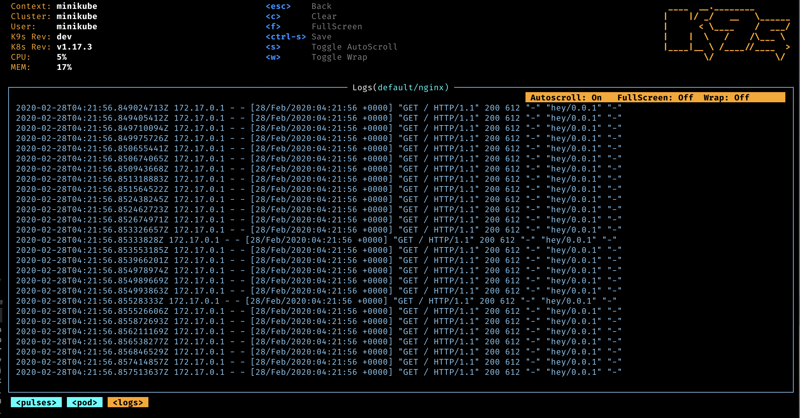
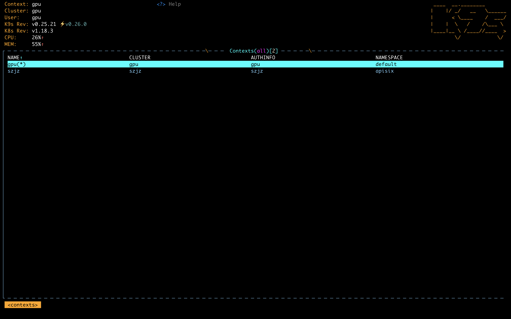
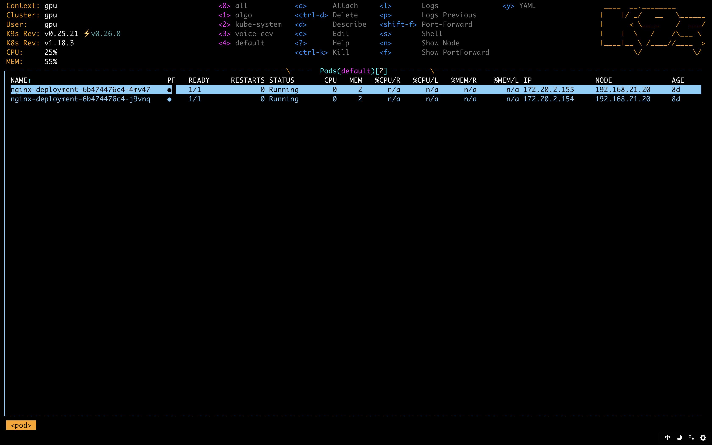
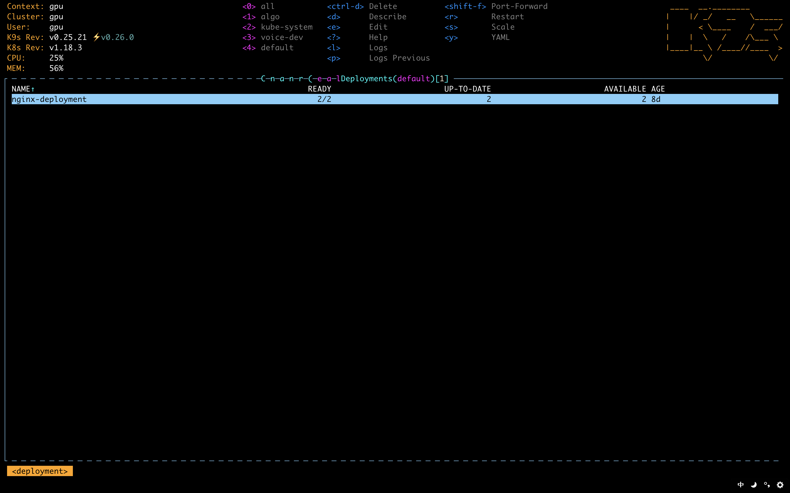
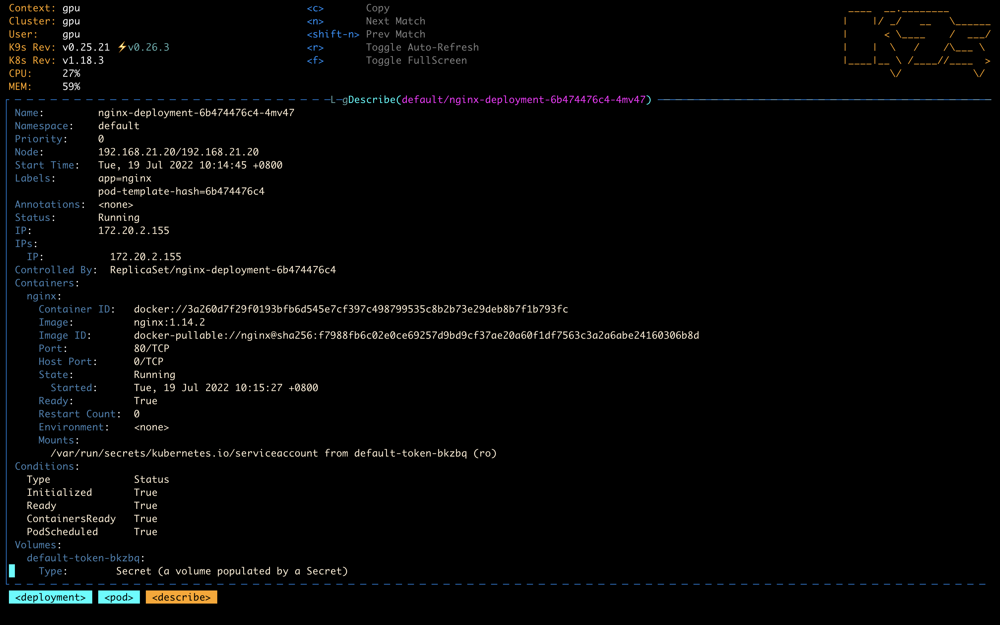
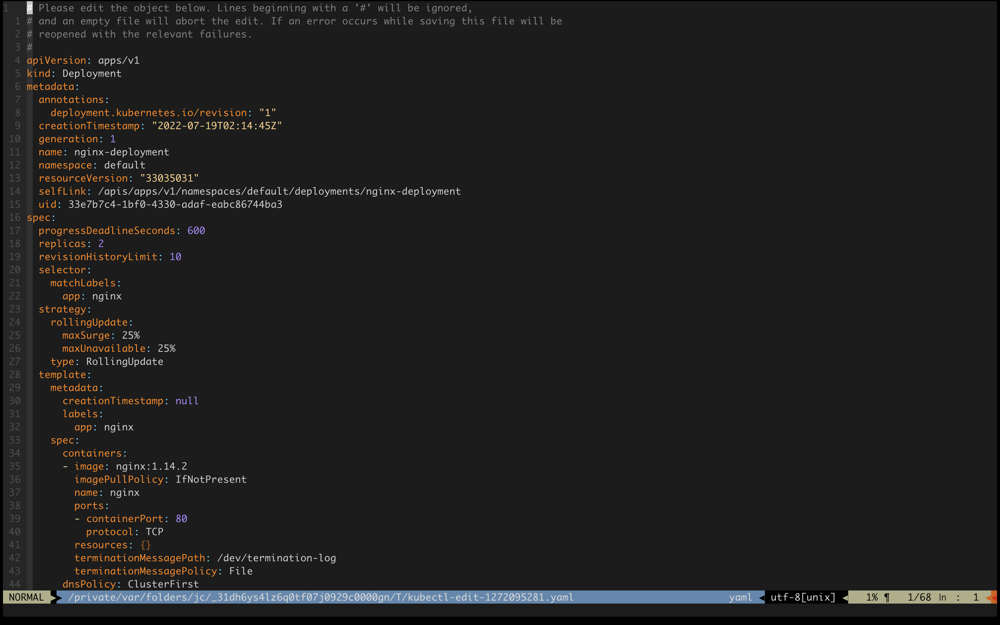
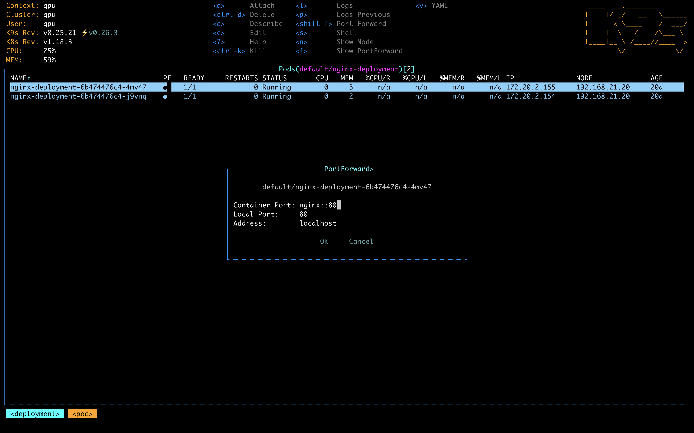
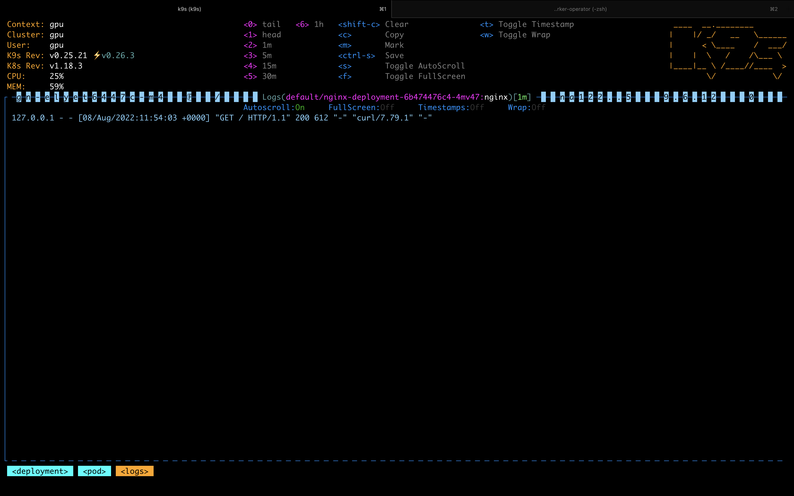

K9s is a terminal-based Kubernetes UI management tool. It's just a single binary — you can manage your K8s cluster from any terminal. The controls are based on Vim, so if you're comfortable with Vim, you'll be up and running in minutes.

<!--  -->

<!--more-->

---

## Installation

K9s supports Linux, macOS, and Windows. The recommended approach is to download the binary directly from the official [releases](https://github.com/derailed/k9s/releases) page.

Like kubectl, K9s uses the kubeconfig specified by the `KUBECONFIG` environment variable by default. You can also specify a config file directly:
`k9s --kubeconfig=xx`

## Walkthrough

Let's use the official sample deployment to demonstrate K9s' common operations.

```bash
kubectl create -f https://k8s.io/examples/application/deployment.yaml
```

Once created, we want to check the deployment status.

Type `k9s` in your terminal to enter the Context screen.



Use the arrow keys `↑↓` or Vim's `jk` to select the cluster you want to manage, then press `ENTER` to enter it.

If you don't see this screen, you can type `:ctx` and press `ENTER` to get there.

K9s' basic commands are similar to Vim — use a colon followed by a resource type `:resource` to navigate to different resource views.

One level below the Context screen is Pods. If your namespace has too many Pods, you can filter with `/filter` — for example, type `/nginx`.



You can also type `:deploy` to jump to the Deployments screen, select the Nginx Deployment, and press `ENTER` to see all its Pods.

*K9s has built-in command autocompletion — type `de` and press `Tab` to auto-complete to `deploy`.*



At this point you can see the status of Pods or Deployments. For more detailed information, use the `d` or `y` shortcuts to view resource details or the YAML manifest.



*While browsing, you can also use common Vim navigation: Page Down, Page Up, `g`/`G` to jump to the top/bottom, and the filter still works.*

Press `ESC` to go back up a level when done.

If you find a deployment misconfiguration, use the `e` shortcut to open Vim and edit the resource's YAML definition.

*Almost all resource types can be edited. If the modified syntax is incorrect, K9s will alert you that the change failed and it won't be applied.*



Once the deployment is confirmed successful, I want to see Nginx logs. From the Pods screen, press `ENTER` to go into the logs view, or from the Deployment or Pod screen, use the `l` shortcut to jump directly to logs.

Since the sample Nginx only shows access logs, the screen will display `Waiting for logs...`.

What if we want to quickly access Nginx? K9s gives you two options.

The first is Shell — equivalent to `kubectl exec pod /bin/sh`. Press `ESC` to go back to the Pod screen, then press `s` to enter the container's shell. If the Pod has multiple containers, you'll be taken to a container selection screen first.

This was the feature that initially drew me to K9s — compared to manually composing commands, it's much faster and more convenient.

Now type `curl localhost:80` — but unfortunately, the image doesn't include curl.

So we'll go with the second option: port-forward. Type `exit` to leave the shell, then press `Shift+f` to enter the Port Forward screen.



This corresponds to the `kubectl port-forward` command. Use `Tab` to switch between fields. Once confirmed, open a new terminal locally and run `curl localhost:80`.

*Port forwards are terminated when you close K9s.*

Now go back to the log screen and you'll see the new log entries.



Navigating logs works just like Vim — movement, filtering, and jumping all apply.

*When viewing container logs, I usually press `0` and `w`: `0` shows the tail (latest logs), and `w` enables line wrapping.*

Beyond these basics, K9s also supports Node Shell (press `s` on the Node screen to enter the host container), Xray (a tree view of K8s resources), stress testing, and more. Check the official site if you're interested.

That covers the operations I use most often with K9s. Below is a translated command reference.

## Commands

| Action | Command | Notes |
| ------ | ------- | ----- |
| Show keyboard shortcuts | `?` | |
| Show all cluster resources and their abbreviations | `ctrl-a` or `:alias` | e.g., service → svc |
| Quit | `:q` or `ctrl-c` | |
| Browse a resource type by name or abbreviation | `:po⏎` | Accepts singular, plural, abbreviation, or alias. e.g., po, pod, pods, v1/pods |
| Browse resources in a specific namespace | `:po namespace⏎` | |
| Filter resources | `/`filter⏎ | Supports Regex2, e.g., `fred\|blee` to filter names matching fred or blee |
| Inverse filter | `/`!filter | Excludes matching resources. Not supported for log filtering |
| Filter by labels | `/`-l label-selector⏎ | |
| Fuzzy match filter | `/`-f filter | |
| Exit browse/command/filter mode | `<esc>` | |
| Common shortcuts: describe, view, edit, view logs, ... | `d`, `v`, `e`, `l`, ... | |
| Switch cluster context | `:`ctx⏎ | |
| Switch cluster context | `:`ctx context-name⏎ | |
| Switch namespace | `:`ns⏎ | |
| Browse all saved resources | `:`screendump or sd⏎ | |
| Delete resource (TAB and ENTER to confirm) | `ctrl-d` | |
| Kill a resource (no confirmation dialog) | `ctrl-k` | |
| Toggle wide columns | `ctrl-w` | Equivalent to `kubectl ... -o wide` |
| Browse resources in error state | `ctrl-z` | |
| Pulses view | `:`pulses or pu⏎ | GUI-like monitoring dashboard in the terminal |
| XRay view | `:`xray RESOURCE [NAMESPACE]⏎ | Tree structure showing related resources |
| Popeye view | `:`popeye or pop⏎ | Popeye is a K8s sanitizer that identifies potentially problematic resources and configs. See <https://popeyecli.io/> |
