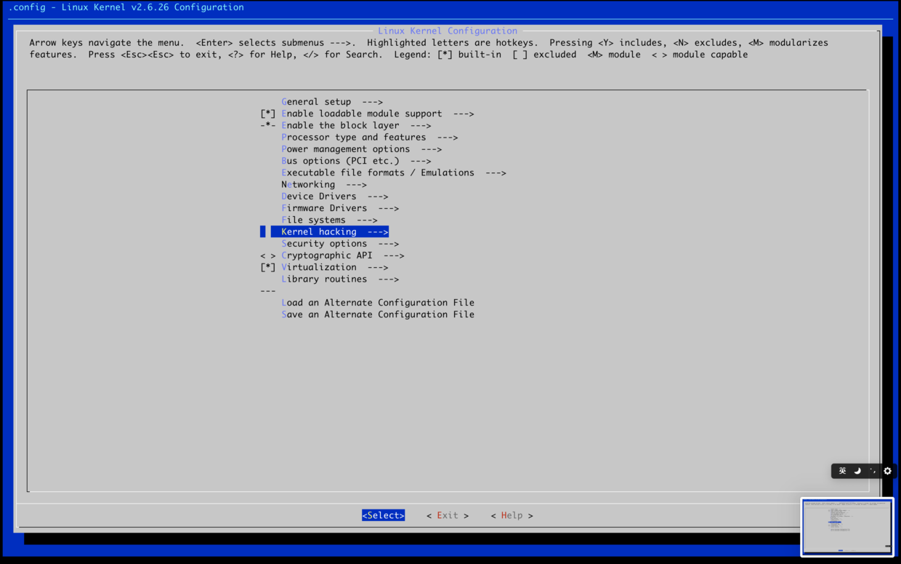
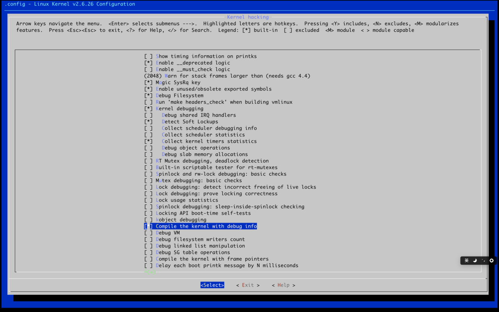

I've been reading *Linux Kernel Development* recently, and the book starts off by having you set up a Linux 2.6 environment.

Getting the environment right took me several days of wrestling. So here's a walkthrough of the setup process and the pitfalls you might run into.

<!--more-->

---

## Base Environment

OS (virtual machine): ubuntu-14.04 64-bit (ubuntu-14.04.6-server-amd64)
Linux kernel: 2.6.26
qemu: 2.0.0
busybox: 1.20.1
gcc: 4.8.4

I used a VM to run Ubuntu for compilation, then built a root filesystem with BusyBox, and finally used QEMU as an emulator to boot the compiled Linux kernel.
**I strongly recommend using the exact same environment for compilation — you'll otherwise run into a lot of unnecessary trouble. When you're just getting started, it's not worth wasting time on compatibility issues.**

> The kernel compiled here is 32-bit because this version of QEMU and GDB has bugs when debugging 64-bit systems.
> You could also just use a 32-bit Ubuntu directly, which would simplify compilation, but VSCode Remote doesn't support connecting to 32-bit systems.
> You might want to read up on what a root filesystem is.

The steps below are primarily for macOS, but the process is largely the same on Windows/Linux.
> I've completed the setup on both Windows and macOS.

## System Environment Setup

### 1. Create a VM with Vagrant

> Vagrant is a VM management tool that simplifies creating and destroying virtual machines. Under the hood it still uses VirtualBox. If you don't want to use Vagrant, you can use VirtualBox/VMware directly.

```bash
$ echo """Vagrant.configure("2") do |config|
  config.vm.box = "ubuntu/trusty64"
  config.vm.box_check_update = false
  config.vm.network "private_network", ip: "192.168.33.100"
  config.vm.provider "virtualbox" do |vb|
    vb.cpus = 2
    vb.memory = "1024"
  end
end
""" > Vagrantfile

$ vagrant up
$ vagrant ssh
$ sudo su
```

> All subsequent operations assume root privileges.

### 2. Switch to a Chinese mirror (Aliyun)

```bash
$ cd /etc/apt
$ cp sources.list sources.backup
$ echo """
deb http://mirrors.aliyun.com/ubuntu/ trusty main restricted universe multiverse
deb http://mirrors.aliyun.com/ubuntu/ trusty-security main restricted universe multiverse
deb http://mirrors.aliyun.com/ubuntu/ trusty-updates main restricted universe multiverse
deb http://mirrors.aliyun.com/ubuntu/ trusty-proposed main restricted universe multiverse
deb http://mirrors.aliyun.com/ubuntu/ trusty-backports main restricted universe multiverse
deb-src http://mirrors.aliyun.com/ubuntu/ trusty main restricted universe multiverse
deb-src http://mirrors.aliyun.com/ubuntu/ trusty-security main restricted universe multiverse
deb-src http://mirrors.aliyun.com/ubuntu/ trusty-updates main restricted universe multiverse
deb-src http://mirrors.aliyun.com/ubuntu/ trusty-proposed main restricted universe multiverse
deb-src http://mirrors.aliyun.com/ubuntu/ trusty-backports main restricted universe multiverse
""" > sources.list
$ apt-get update
```

### 3. Install the build environment

```bash
$ apt-get install -y libncurses5-dev build-essential
$ apt-get install -y lib32readline-gplv2-dev # for compiling 32-bit
```

### 4. Install the debugging environment

```bash
$ apt-get install -y qemu-system-x86 gdb
```

### 5. Download Linux and BusyBox

```bash
$ mkdir linux
$ cd linux
$ wget https://www.busybox.net/downloads/busybox-1.20.1.tar.bz2
$ wget https://mirrors.edge.kernel.org/pub/linux/kernel/v2.6/linux-2.6.26.tar.bz2
$ tar -xf busybox-1.20.1.tar.bz2
$ tar -xf linux-2.6.26.tar.bz2
```

## Linux Compilation

### 1. Apply the patch

Create a file called `fix.patch` inside the `linux-2.6.26` directory and paste the following:

```diff
diff -Naur linux-2.6.26/arch/x86/lib/copy_user_64.S linux-2.6.26-2/arch/x86/lib/copy_user_64.S
--- linux-2.6.26/arch/x86/lib/copy_user_64.S	2008-07-13 21:51:29.000000000 +0000
+++ linux-2.6.26-2/arch/x86/lib/copy_user_64.S	2021-04-22 07:04:49.894796787 +0000
@@ -341,7 +341,7 @@
 11:	pop %rax
 7:	ret
 	CFI_ENDPROC
-END(copy_user_generic_c)
+END(copy_user_generic_string)
 
 	.section __ex_table,"a"
 	.quad 1b,3b
diff -Naur linux-2.6.26/arch/x86/vdso/Makefile linux-2.6.26-2/arch/x86/vdso/Makefile
--- linux-2.6.26/arch/x86/vdso/Makefile	2008-07-13 21:51:29.000000000 +0000
+++ linux-2.6.26-2/arch/x86/vdso/Makefile	2021-04-22 07:05:29.090798510 +0000
@@ -25,7 +25,7 @@
 
 export CPPFLAGS_vdso.lds += -P -C
 
-VDSO_LDFLAGS_vdso.lds = -m elf_x86_64 -Wl,-soname=linux-vdso.so.1 \
+VDSO_LDFLAGS_vdso.lds = -m64 -Wl,-soname=linux-vdso.so.1 \
 		     	-Wl,-z,max-page-size=4096 -Wl,-z,common-page-size=4096
 
 $(obj)/vdso.o: $(src)/vdso.S $(obj)/vdso.so
@@ -69,7 +69,7 @@
 vdso32-images			= $(vdso32.so-y:%=vdso32-%.so)
 
 CPPFLAGS_vdso32.lds = $(CPPFLAGS_vdso.lds)
-VDSO_LDFLAGS_vdso32.lds = -m elf_i386 -Wl,-soname=linux-gate.so.1
+VDSO_LDFLAGS_vdso32.lds = -m32 -Wl,-soname=linux-gate.so.1
 
 # This makes sure the $(obj) subdirectory exists even though vdso32/
 # is not a kbuild sub-make subdirectory.
diff -Naur linux-2.6.26/kernel/mutex.c linux-2.6.26-2/kernel/mutex.c
--- linux-2.6.26/kernel/mutex.c	2008-07-13 21:51:29.000000000 +0000
+++ linux-2.6.26-2/kernel/mutex.c	2021-04-22 07:06:51.646802139 +0000
@@ -58,7 +58,7 @@
  * We also put the fastpath first in the kernel image, to make sure the
  * branch is predicted by the CPU as default-untaken.
  */
-static void noinline __sched
+static __used void noinline __sched
 __mutex_lock_slowpath(atomic_t *lock_count);
 
 /***
@@ -95,7 +95,7 @@
 EXPORT_SYMBOL(mutex_lock);
 #endif
 
-static noinline void __sched __mutex_unlock_slowpath(atomic_t *lock_count);
+static __used noinline void __sched __mutex_unlock_slowpath(atomic_t *lock_count);
 
 /***
  * mutex_unlock - release the mutex
@@ -270,7 +270,7 @@
 /*
  * Release the lock, slowpath:
  */
-static noinline void
+static __used noinline void
 __mutex_unlock_slowpath(atomic_t *lock_count)
 {
 	__mutex_unlock_common_slowpath(lock_count, 1);
@@ -315,7 +315,7 @@
 }
 EXPORT_SYMBOL(mutex_lock_killable);
 
-static noinline void __sched
+static __used noinline void __sched
 __mutex_lock_slowpath(atomic_t *lock_count)
 {
 	struct mutex *lock = container_of(lock_count, struct mutex, count);
diff -Naur linux-2.6.26/Makefile linux-2.6.26-2/Makefile
--- linux-2.6.26/Makefile	2008-07-13 21:51:29.000000000 +0000
+++ linux-2.6.26-2/Makefile	2021-04-22 07:03:43.150793853 +0000
@@ -214,8 +214,8 @@
 
 HOSTCC       = gcc
 HOSTCXX      = g++
-HOSTCFLAGS   = -Wall -Wstrict-prototypes -O2 -fomit-frame-pointer
-HOSTCXXFLAGS = -O2
+HOSTCFLAGS   = -Wall -Wstrict-prototypes -O1 -fomit-frame-pointer
+HOSTCXXFLAGS = -O1
 
 # Decide whether to build built-in, modular, or both.
 # Normally, just do built-in.
@@ -502,9 +502,9 @@
 all: vmlinux
 
 ifdef CONFIG_CC_OPTIMIZE_FOR_SIZE
-KBUILD_CFLAGS	+= -Os
+KBUILD_CFLAGS	+= -O1
 else
-KBUILD_CFLAGS	+= -O2
+KBUILD_CFLAGS	+= -O1
 endif
 
 ifneq (CONFIG_FRAME_WARN,0)
```

```bash
$ patch -p1 < fix.patch
```

> If the patch fails, it might be because the tabs in `fix.patch` got converted to spaces. In that case, manually apply the changes to the source files as shown above.

### 2. Set build configuration

```bash
$ make ARCH=i386 defconfig
$ make ARCH=i386 menuconfig
```

> If you get:
> Your display is too small to run Menuconfig! It must be at least 19 lines by 80 columns.
> Your terminal window is too small. Switch to full screen and reconfigure.

Enable debug info options:

> Use arrow keys to navigate, Tab to switch between options below




### 3. Start compilation

```bash
$ make ARCH=i386 -j2
```
> `-jN` enables parallel compilation — the number is typically CPU cores × 2.

On success, you'll see:

```bash
Root device is (252, 0)
Setup is 12288 bytes (padded to 12288 bytes).
System is 2844 kB
CRC 31a57b1f
Kernel: arch/x86/boot/bzImage is ready  (#1)
```

> Compilation time depends on your hardware — typically a few to a dozen minutes.
> I'm using a 2018 MBP with a 2.2 GHz 6-core i7, VM configured with 4 cores. Compilation took 5m10s.
> If compilation feels too slow, here are a few ways to speed it up:
> 1. Increase the VM's core count and bump up the `-j` number.
> 2. Use a tmpfs filesystem to place source code directly in memory.
> 3. Use ccache to cache each compilation result.

# Creating the Root Filesystem

### 1. Create the image

```bash
$ cd ..
$ dd if=/dev/zero of=initrd.img count=1024 bs=4096
$ mkfs.ext2 initrd.img
$ mkdir rootfs
$ mount -o loop initrd.img rootfs/
```

### 2. Create character devices

```bash
$ mkdir rootfs/dev
$ mknod rootfs/dev/console c 5 1
$ mknod rootfs/dev/ram b 1 0
```

### 3. Apply BusyBox patch

```bash
$ cd busybox-1.20.1
$ echo """diff -Naur busybox-1.20.1/include/libbb.h busybox-1.20.1-2/include/libbb.h
--- busybox-1.20.1/include/libbb.h	2012-05-28 00:46:41.000000000 +0000
+++ busybox-1.20.1-2/include/libbb.h	2021-04-21 07:55:27.526183582 +0000
@@ -12,6 +12,8 @@
 
 #include "platform.h"
 
+
+#include <sys/resource.h>
 #include <ctype.h>
 #include <dirent.h>
 #include <errno.h>
""" > fix.patch
$ patch -p1 < fix.patch
```

### 4. Modify the Makefile

In vi, type `292G` to jump to line 292, then append `-m32` at the end:

```bash
$ vi Makefile
CC              = $(CROSS_COMPILE)gcc -m32
```

### 5. Set build options

```bash
$ make defconfig
$ make menuconfig
```

Select static linking:


Disable the Shell → Job Control option:


### 6. Compile and install BusyBox

```bash
$ make -j2
$ make CONFIG_PREFIX=../rootfs install
```

After installation, you should see this in the `rootfs` directory:

```bash
$ cd ..
$ ls -lah rootfs/
total 20
drwxr-xr-x 5 root root 4096 Apr 21 08:05 ./
drwxr-xr-x 7 root root 4096 Apr 21 08:05 ../
drwxr-xr-x 2 root root 4096 Apr 21 08:05 bin/
lrwxrwxrwx 1 root root   11 Apr 21 08:05 linuxrc -> bin/busybox*
drwxr-xr-x 2 root root 4096 Apr 21 08:05 sbin/
drwxr-xr-x 4 root root 4096 Apr 21 08:05 usr/
```

### 7. Unmount rootfs

```bash
$ umount rootfs
```

## Booting the System

```bash
$ qemu-system-x86_64 \
-nographic \
-kernel ./linux-2.6.26/arch/x86/boot/bzImage \
-initrd ./initrd.img \
-append "root=/dev/ram init=/bin/sh console=ttyS0"
```

> Use Ctrl+A then X to exit QEMU.

```bash
input: ImExPS/2 Generic Explorer Mouse as /class/input/input2
RAMDISK: ext2 filesystem found at block 0
RAMDISK: Loading 4096KiB [1 disk] into ram disk... done.
VFS: Mounted root (ext2 filesystem) readonly.
Freeing unused kernel memory: 448k freed
/ #
```

### Troubleshooting

```bash
VFS: Mounted root (ext2 filesystem) readonly.
Freeing unused kernel memory: 448k freed
Warning: unable to open an initial console.
Failed to execute /bin/ash.  Attempting defaults...
Kernel panic - not syncing: No init found.  Try passing init= option to kernel.
```

If you see this error, the root filesystem wasn't created correctly. Go through the steps above again.

```bash
VFS: Mounted root (ext2 filesystem) readonly.
Freeing unused kernel memory: 448k freed
```

If it only shows the VFS message and hangs, you didn't enable ext2 support when compiling the Linux kernel. Go back to `make menuconfig` and enable that option.

```bash
/bin/ash: can't access tty; job control turned off
```

If you see this job control warning, go back to BusyBox compilation and disable that option.

## GDB Debugging

### 1. Start QEMU with debug options

```bash
$ qemu-system-x86_64 \
-nographic \
-kernel ./linux-2.6.26/arch/x86/boot/bzImage \
-initrd ./initrd.img \
-append "root=/dev/ram init=/bin/ash console=ttyS0" -s -S
```

### 2. Start GDB

In another terminal:

```bash
$ cd linux
$ gdb --dir=./linux-2.6.26
(gdb) file linux-2.6.26/vmlinux
(gdb) target remote :1234
(gdb) hb start_kernel
(gdb) c
```

> `gdb -tui` enables a TUI mode that shows source code in real time.
> You must use `hb` (hardware breakpoint) — this is due to a GDB bug: [gdbserver inside qemu does not stop on breakpoints](https://bugs.launchpad.net/ubuntu/+source/qemu-kvm/+bug/901944)

> If you're tired of typing `file` and `target` every time, create a GDB init file:
> ```bash
> $ echo """
> file linux-2.6.26/vmlinux
> target remote :1234
> """ > /root/.gdbinit
> $ echo """
> set auto-load safe-path /
> """ > .gdbinit
> ```

## VSCode

If you're browsing the source in VSCode, check out this article: [Setting up a kernel driver development environment in VSCode on Linux](https://blog.mxslly.com/archives/170.html)

## References

[Building a Linux 2.6 kernel debugging environment for studying ULK3](https://zhuanlan.zhihu.com/p/35180950)

[elf_i386 or elf_x86_64: No such file or directory — solution](https://blog.csdn.net/jackailson/article/details/50768318)

[Kernel 2.6.22.6 compilation error: undefined reference to __mutex_unlock_slowpath](https://blog.csdn.net/vern990/article/details/40143667)

[Linux kernel compilation error: .size expression for copy_user_generic_c does not evaluate to a constant](https://blog.csdn.net/whatday/article/details/101998506)
