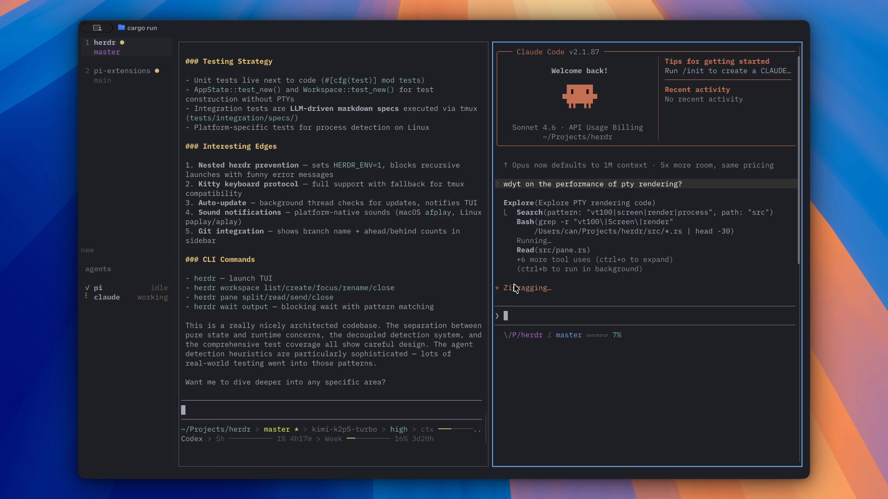
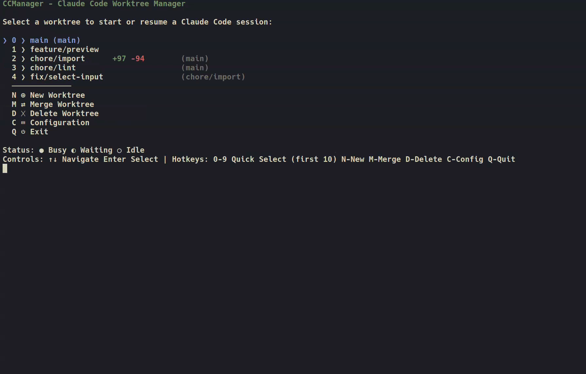
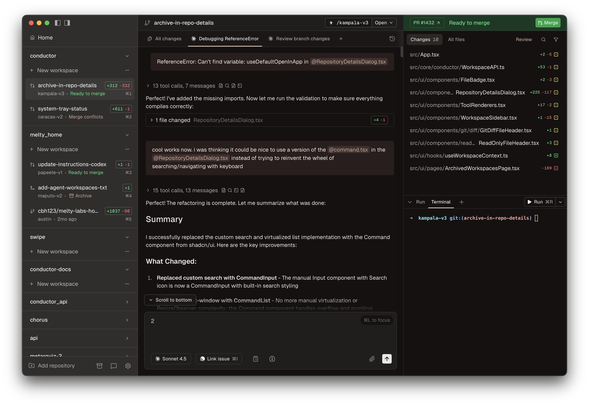
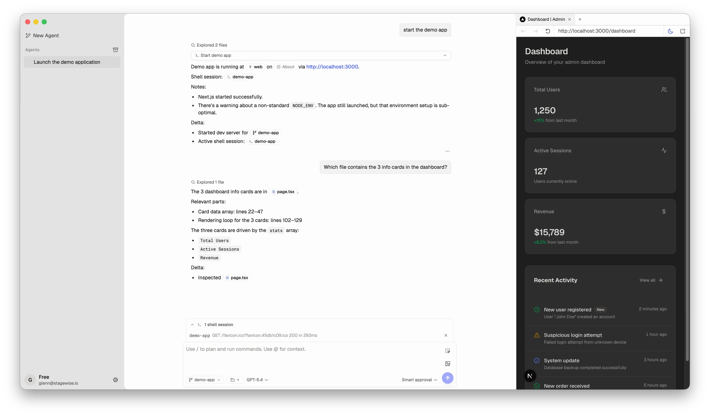
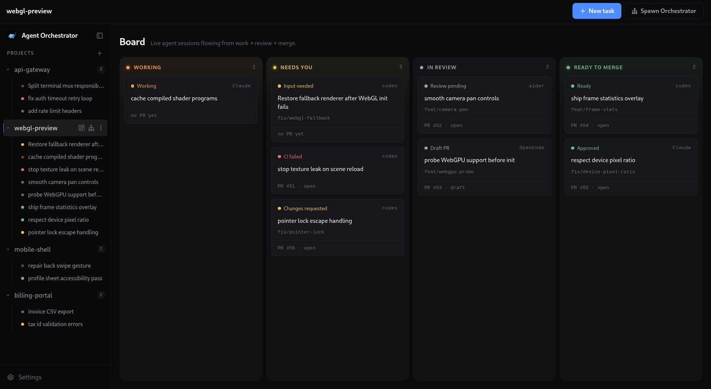

If you're using terminal AI agents like Claude Code, Codex, Gemini CLI, and OpenCode at the same time, you're not just opening one. You open several terminal tabs and have them work on different tasks in parallel. Before long, it turns into chaos — which agent is doing what? Who changed which file? What happens when they conflict?

That's exactly the problem these "multi-agent management tools" aim to solve. A lot of them have popped up in the last six months. I've organized them into four categories based on their approach.

## Agent Terminal: Building Agent Management Directly Into the Terminal

These tools start from the terminal itself, with agent management built in at the core — not as a plugin or overlay, but designed from the ground up for AI agents.

### Warp — An Agentic Environment Born From the Terminal

[Warp](https://github.com/warpdotdev/warp) (62,726 stars) calls itself an "agentic development environment, born out of the terminal." It started as a modern terminal and evolved into a full AI development environment. It has a built-in Agent Mode where you interact with AI agents directly in the terminal. The philosophy is "the terminal itself is the agent" — not agents running inside a terminal, but the terminal as the agent. Warp is partially closed-source, but the terminal core is open-source.

### cmux — An AI Agent Terminal Built on Ghostty

[cmux](https://github.com/manaflow-ai/cmux) (23,408 stars) is built on [Ghostty](https://github.com/ghostty-org/ghostty) (57,469 stars, a high-performance terminal emulator written in Zig), designed specifically for AI coding agents. It features vertical tabs, a notification system, push notifications when agent tasks complete, and a built-in browser. You can manage multiple agent sessions in a single window — no need to stare at the screen waiting for agents to finish.

Compared to Warp: Warp has bigger ambitions — it wants to be a complete development environment; cmux is more focused, aiming to be an AI-agent-friendly terminal. Wave leans toward integrating various tools into the terminal, not just agent management. Ghostty is cmux's underlying engine, but Ghostty itself doesn't include agent management features — it's purely a high-performance terminal emulator.

### Wave Terminal — Open-Source Cross-Platform AI Terminal

[Wave Terminal](https://github.com/wavetermdev/waveterm) (21,516 stars) is another open-source AI-integrated terminal, cross-platform (macOS/Linux/Windows), with built-in AI workflows, graphics rendering, and file preview. Compared to Warp and cmux, Wave emphasizes "doing everything in one terminal" — not just agents, but also data visualization, SSH management, and web previews.

## Session Manager: Managing Multiple Agent Sessions in Your Existing Terminal

These tools don't tie you to a specific terminal — you can use them in iTerm, Alacritty, or even Warp. The core idea is "run multiple agents in the terminal and keep them organized."

How they differ from "Agentic IDEs" below: Session Managers live in the terminal, with TUI or tmux as their interface; Agentic IDEs are standalone GUI applications that look like traditional editors.

### herdr — Agent Multiplexer

[herdr](https://github.com/ogulcancelik/herdr) (10,006 stars) is closest to traditional tmux — manage multiple agents in one terminal window, each running in an isolated workspace. It doesn't lock you into any particular terminal.

### claude-squad — Agent Teams on tmux

[claude-squad](https://github.com/smtg-ai/claude-squad) (7,997 stars) uses tmux to manage multiple AI agents (Claude Code, Codex, OpenCode, Amp). If you're already a tmux user, this feels the most natural — it doesn't introduce a new UI layer, it just splits tmux panes for running agents.

### ccmanager — Most Agent Types Supported

[ccmanager](https://github.com/kbwo/ccmanager) (1,173 stars) supports eight types of agents: Claude Code, Gemini CLI, Codex, Cursor, Copilot, Cline, OpenCode, and Kimi CLI. Switch between them in a single TUI — no need to remember which agent is in which tab.

### agent-of-empires — TUI + Web Dual Interface

[agent-of-empires](https://github.com/agent-of-empires/agent-of-empires) (2,721 stars) is written in Rust, uses tmux + git worktree for agent isolation, and supports Claude Code, OpenCode, Codex, Gemini CLI, Copilot CLI, Pi.dev, and more. It offers both TUI and web interfaces — you can manage agents from your phone.

It got 118 points and 44 comments on HN — the highest community praise in this category. Compared to ccmanager: agent-of-empires leans more toward "keeping multiple agents working in parallel without conflicts," while ccmanager leans more toward "managing sessions across different agent types."

herdr is closest to a universal multiplexer, claude-squad is a natural extension for tmux users, ccmanager supports the most explicit set of agent types (8), and agent-of-empires has the best worktree isolation plus mobile access.

## Agentic IDE: Agent Management in Editor Form

These tools look like IDEs, but their core is agent management. You don't write code with AI assistance — AI agents write code while you review.

### Superset — Code Editor for the AI Agent Era

[Superset](https://github.com/superset-sh/superset) (12,215 stars) calls itself a "Code Editor for the AI Agents Era." It's a GUI editor designed specifically for running multiple AI agents simultaneously. It supports Claude Code, Codex, Amp Code, and Cursor Agent. Different tabs manage different agent sessions — the interface resembles a traditional IDE, but the workflow is "agents write, you review."

### Conductor — Superset's Biggest Competitor

[Conductor](https://conductor.build) is a macOS desktop app that runs agents like Claude Code, Codex, and Cursor in parallel across isolated git worktrees, with a unified dashboard for monitoring, code review, and merging. It got 228 points on HN ([Show HN](https://news.ycombinator.com/item?id=44594584)) with 115 comments. It's a closed-source commercial product developed by Melty Labs.

Compared to Superset: Superset is open-source (visible on GitHub), Conductor is a closed-source commercial product. HN user motoboi summed it up: "superset is terminal-centric while conductor is chat-centric" — Superset feels more like an editor, Conductor more like chat + dashboard.

### stagewise — Open-Source Agentic IDE

[stagewise](https://github.com/stagewise-io/stagewise) (6,713 stars) is also positioned as an Agentic IDE, with built-in agent orchestration, app preview, and git workflows. Compared to Superset, it leans more toward orchestration and workflow automation, while Superset leans more toward the editor experience.

## Orchestrator: Breaking One Task Across Multiple Agents

This layer works differently: it's not about "helping you manage agents" — it's about "agents doing the work for you." You give one task, the orchestrator breaks it into subtasks, distributes them to different agents, and collects the results.

### ruflo — 62k Stars Meta-Harness

[ruflo](https://github.com/ruvnet/ruflo) (62,552 stars) currently has the highest star count in this category. Whether the underlying engine is Claude Code, Codex, or Hermes, it adds an orchestration layer and adaptive memory on top. The star count shows people see value in this direction, but stars don't equal usability.

### oh-my-claudecode — Claude Code-Specific Orchestration

[oh-my-claudecode](https://github.com/Yeachan-Heo/oh-my-claudecode) (37,308 stars) focuses solely on team-level parallel orchestration for Claude Code. If you only use Claude Code, this is more focused than ruflo.

### agent-orchestrator — Auto-Handling CI and Merge Conflicts

[agent-orchestrator](https://github.com/AgentWrapper/agent-orchestrator) (7,868 stars) leans toward engineering workflows: parallel agent orchestration, automatic CI fixes, merge conflict resolution, and code review. Great for embedding agents into CI/CD pipelines.

### omnigent — Painless Multi-Agent Switching

[omnigent](https://github.com/omnigent-ai/omnigent) (6,001 stars) supports Claude Code, Codex, Cursor, and Pi. Its selling point is "painless harness switching" — use Claude Code today, switch to Codex tomorrow, no orchestration-layer code changes needed.

### Others

- [paseo](https://github.com/getpaseo/paseo) (9,627 stars) — desktop + mobile multi-agent orchestration
- [sandcastle](https://github.com/mattpocock/sandcastle) (6,583 stars) — by Matt Pocock, `sandcastle.run()` launches sandboxes with a single call
- [1code](https://github.com/21st-dev/1code) (5,628 stars) — orchestration layer for Claude Code/Codex

## What the Community Is Debating

A few recurring debates keep surfacing in HN and Chinese community discussions.

**Orchestration vs. waiting for stronger models.** Some argue orchestration tools are transitional — a sufficiently strong model will crush any gains orchestration provides. HN user [mordymoop](https://news.ycombinator.com/item?id=44594584) said: "The intelligence improvements of the models themselves will eventually overwhelm any capability gains from any orchestrator." The counter-argument: orchestrating cheaper models can match or even exceed flagship model success rates. In a [test](https://juejin.cn/post/7652581847890165786) by Juejin author 米小虾, three Sonnet instances orchestrated together were cheaper and had higher success rates than a single Opus — though strictly speaking, the cost savings can't be cleanly attributed to orchestration alone vs. model capability differences. Still, the general direction holds: orchestration + cheap models vs. a single flagship model — the former is likely more cost-effective.

**Does parallelism actually work?** HN user [deepdarkforest](https://news.ycombinator.com/item?id=44533339) said: "I tried every single coding agent... whenever I try to parallelize, they clash while editing files simultaneously... It's chaos." Nearly all successful approaches point to the same solution: git worktree isolation + test gating. Parallelism without isolation is asking for trouble.

**Code quality vs. throughput.** [px1999](https://news.ycombinator.com/item?id=46748579) (HN) hit a real issue: "Few people focus on building high quality changes vs maximising throughput of low quality work items." Multi-agent tools all emphasize "running N agents simultaneously," but more output doesn't mean better output.

Both sides have valid points — orchestration really can save money and improve efficiency, but only if isolation and review are done right. Otherwise parallelism just accelerates chaos. This isn't a binary choice; it's an engineering problem at the execution level.

---

My current use case is managing multiple Pi Agents and Hermes Agents simultaneously. I use cmux as my terminal on macOS, Warp on Windows, and I'm considering replacing my current setup with herdr.
