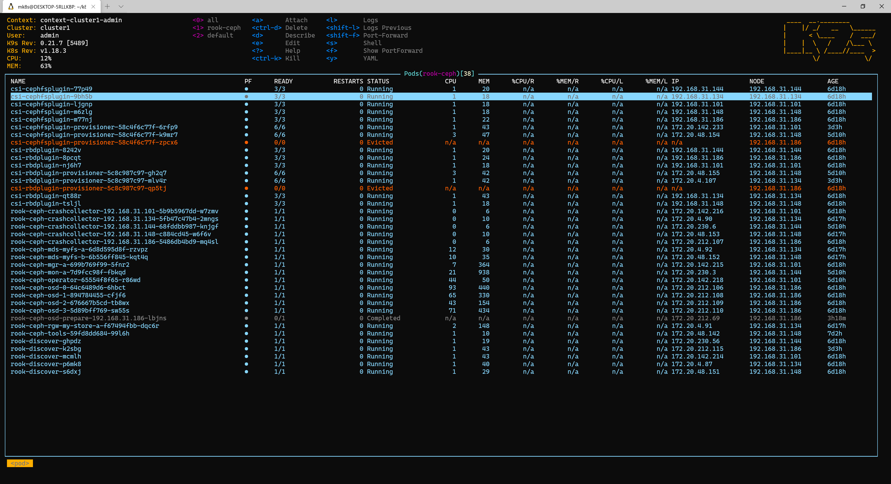
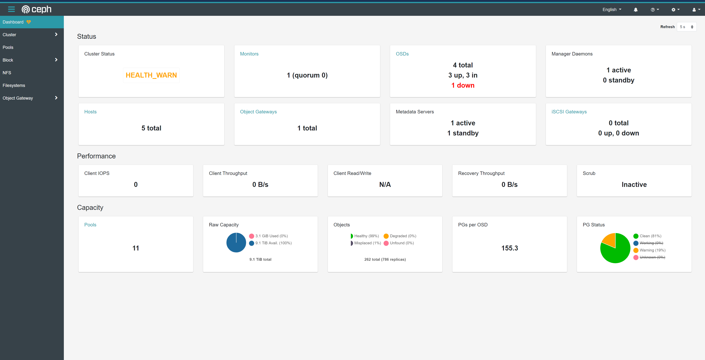

ROOK — an open-source, cloud-native storage orchestrator offering multiple storage solutions.

<!--more-->

---

## Why ROOK

In the past, setting up large-scale storage for Kubernetes environments meant choosing between NFS or a highly available Ceph cluster. If you went the DIY route, unfamiliarity with these systems meant running into all sorts of pitfalls — eating into your already scarce free time.

Now, with ROOK, you can get a cluster up and running quickly by tweaking just a few parameters. The storage cluster comes with automatic failover, monitoring, and other automated features — saving you time, effort, and headaches. While cloud providers generally offer their own storage solutions these days, ROOK is still a great choice for home labs and test environments.

I went with ROOK's Ceph cluster option because it gives you full access to Ceph's capabilities:

- Persistent block storage for individual Pods
- Object storage with an S3-compatible interface
- CephFS for shared storage across multiple Pods

## Cluster Environment

OS: Ubuntu 20.04.1 LTS (GNU/Linux 5.4.0-48-generic x86_64)

Kubernetes: v1.18.3

Machines:

| ip/host            | Notes                                                        | Role   |
| ------------------ | ------------------------------------------------------------ | ------ |
| 192.168.31.101 ub1 | VM 1C4G 300G (i3-8100 laptop, VMware ESXi virtualizing ub1~3) | Master |
| 192.168.31.134 ub2 | VM 1C4G 300G                                                 | Master |
| 192.168.31.148 ub3 | VM 1C4G 300G                                                 | Master |
| 192.168.31.186 ub4 | 4C8G 30G 2.75T+2.75T+3.65T+150G (two used 3TB green drives, one 4TB WD Blue, one salvaged drive; machine is an Interstellar Snail Model B) | Node   |
| 192.168.31.144 ub5 | VM 1C8G 100G (main machine R5-3600+32G, virtualized using spare memory) | Node   |

The disks used for Ceph here are all additional drives attached to ub4.

## Prerequisites

- ROOK: <https://rook.io/docs/rook/v1.5/k8s-pre-reqs.html>
- Ceph: <https://rook.io/docs/rook/v1.5/k8s-pre-reqs.html>

Generally, Ubuntu and CentOS systems meet the requirements out of the box, so I won't go into detail here.

### Clean the Disks

If the disks you're using for the cluster aren't fresh — they have data on them or have been formatted with a filesystem — you need to wipe them first. Otherwise, you'll run into the same problem I had when deploying the Operator:

[rook-ceph-crash-collector-keyring secret not created for crash reporter](https://github.com/rook/rook/issues/4553)

Check whether a disk is empty by verifying its `FSTYPE` is blank:

```bash
lsblk -f
NAME                  FSTYPE      LABEL UUID                                   MOUNTPOINT
vda
└─vda1                LVM2_member       eSO50t-GkUV-YKTH-WsGq-hNJY-eKNf-3i07IB
  ├─ubuntu--vg-root   ext4              c2366f76-6e21-4f10-a8f3-6776212e2fe4   /
  └─ubuntu--vg-swap_1 swap              9492a3dc-ad75-47cd-9596-678e8cf17ff9   [SWAP]
vdb
```

If it's not empty, use the following command to wipe the disk:

```bash
dd if=/dev/zero of=/dev/sdd bs=512K count=1
fdisk -l /dev/sdd
Disk /dev/sdd: 149.5 GiB, 160041885696 bytes, 312581808 sectors
Disk model: WDC WD1600AAJS-0
Units: sectors of 1 * 512 = 512 bytes
Sector size (logical/physical): 512 bytes / 512 bytes
I/O size (minimum/optimal): 512 bytes / 512 bytes
```

## Installation

### 1. Install the ROOK Ceph Cluster Operator

```bash
git clone --single-branch --branch v1.4.7 https://github.com/rook/rook.git
cd rook/cluster/examples/kubernetes/ceph
kubectl create -f common.yaml
kubectl create -f operator.yaml
# kubectl create -f cluster.yaml
```

Once installed correctly, you'll see the CSI plugins (`csi-cephfsplugin`) and the `rook-discover` disk discovery service running in the `rook-ceph` namespace on each node.

> Note: images require pulling through a VPN/proxy

### 2. Install the Ceph Cluster

Modify the configuration based on your machine setup before installing.

```yaml
diff --git a/cluster/examples/kubernetes/ceph/cluster.yaml b/cluster/examples/kubernetes/ceph/cluster.yaml
index b57b8892..efc1c336 100644
--- a/cluster/examples/kubernetes/ceph/cluster.yaml
+++ b/cluster/examples/kubernetes/ceph/cluster.yaml

# Since we're only using disks on a single machine, one monitor is enough

@@ -40,7 +40,7 @@ spec:
   continueUpgradeAfterChecksEvenIfNotHealthy: false
   # set the amount of mons to be started
   mon:
-    count: 3
+    count: 1
     allowMultiplePerNode: false
   mgr:
     modules:
     
# These two settings use all disks on all nodes — generally not recommended,
# as it will also detect your system disk.

@@ -176,8 +176,8 @@ spec:
#    osd: rook-ceph-osd-priority-class
#    mgr: rook-ceph-mgr-priority-class
   storage: # cluster level storage configuration and selection
-    useAllNodes: true
-    useAllDevices: true
+    useAllNodes: false
+    useAllDevices: false
     #deviceFilter:
     config:
       # metadataDevice: "md0" # specify a non-rotational storage so ceph-volume will use it as block db device of bluestore.
       
# Below: specify each disk on ub4

@@ -187,7 +187,7 @@ spec:
       # encryptedDevice: "true" # the default value for this option is "false"
# Individual nodes and their config can be specified as well, but 'useAllNodes' above must be set to false. Then, only the named
# nodes below will be used as storage resources.  Each node's 'name' field should match their 'kubernetes.io/hostname' label.
-#    nodes:
+    nodes:
#    - name: "172.17.4.201"
#      devices: # specific devices to use for storage can be specified for each node
#      - name: "sdb"
@@ -199,6 +199,12 @@ spec:
#        storeType: filestore
#    - name: "172.17.4.301"
#      deviceFilter: "^sd."
+    - name: "192.168.31.186"
+      devices:
+      - name: "sdb"
+      - name: "sdc"
+      - name: "sdd"
+      - name: "sde"
   # The section for configuring management of daemon disruptions during upgrade or fencing.
   disruptionManagement:
     # If true, the operator will create and manage PodDisruptionBudgets for OSD, Mon, RGW, and MDS daemons. OSD PDBs are managed dynamically
```

```bash
kubectl create -f cluster.yaml
```

After successful startup, you'll see the OSDs come up — one per disk, so four in my case.



If the OSD count doesn't look right, check <https://rook.io/docs/rook/v1.4/ceph-common-issues.html#osd-pods-are-not-created-on-my-devices> to diagnose the issue.

### 3. Configure Block Storage StorageClass

By default, the failure domain is set to `host`, which requires at least 3 hosts. Since all my disks are on a single machine, I changed the failure domain to `osd`. If you don't need 3 replicas, you can also set it to 2.

```yaml
diff --git a/cluster/examples/kubernetes/ceph/object.yaml b/cluster/examples/kubernetes/ceph/object.yaml
index dfadaee6..416e725c 100644
--- a/cluster/examples/kubernetes/ceph/object.yaml
+++ b/cluster/examples/kubernetes/ceph/object.yaml
@@ -12,7 +12,7 @@ metadata:
 spec:
   # The pool spec used to create the metadata pools. Must use replication.
   metadataPool:
-    failureDomain: host
+    failureDomain: osd
     replicated:
       size: 3
       # Disallow setting pool with replica 1, this could lead to data loss without recovery.
@@ -27,7 +27,7 @@ spec:
       #target_size_ratio: ".5"
   # The pool spec used to create the data pool. Can use replication or erasure coding.
   dataPool:
-    failureDomain: host
+    failureDomain: osd
     replicated:
       size: 3
       # Disallow setting pool with replica 1, this could lead to data loss without recovery.
```

```bash
kubectl create -f object.yml
```

Once running, you'll see `rook-ceph-block` in your StorageClasses — making persistent storage available for your applications.

Object storage and CephFS setup follow a similar pattern, so I won't cover those here.

### 4. Troubleshooting

If you hit other installation issues, check the official [Ceph Common Issues documentation](https://rook.io/docs/rook/v1.5/ceph-common-issues.html).

### 5. Useful Tools

The default Operator installation includes a Dashboard, but no access method is configured. You'll need to add a Service to expose it:

```yaml
apiVersion: v1
kind: Service
metadata:
  name: rook-ceph-mgr-dashboard-external-https
  namespace: rook-ceph
  labels:
    app: rook-ceph-mgr
    rook_cluster: rook-ceph
spec:
  ports:
  - name: dashboard
    port: 8443
    protocol: TCP
    targetPort: 8443
  selector:
    app: rook-ceph-mgr
    rook_cluster: rook-ceph
  sessionAffinity: None
  type: NodePort
```

```bash
kubectl create -f dashboard-external-https.yaml
$ kubectl -n rook-ceph get service
NAME                                    TYPE        CLUSTER-IP       EXTERNAL-IP   PORT(S)          AGE
rook-ceph-mgr                           ClusterIP   10.108.111.192   <none>        9283/TCP         4h
rook-ceph-mgr-dashboard                 ClusterIP   10.110.113.240   <none>        8443/TCP         4h
rook-ceph-mgr-dashboard-external-https  NodePort    10.101.209.6     <none>        8443:31176/TCP   4h
```

The default installation includes an admin account. Get the password with:

```bash
kubectl -n rook-ceph get secret rook-ceph-dashboard-password -o jsonpath="{['data']['password']}" | base64 --decode && echo
```

Now visit port 31176 on any node to see the dashboard:



## References

- <https://www.cnblogs.com/kevincaptain/p/10655721.html>
- <https://rook.io/docs/rook/v1.4/ceph-common-issues.html>
- <https://rook.io/docs/rook/v1.4/ceph-cluster-crd.html>
