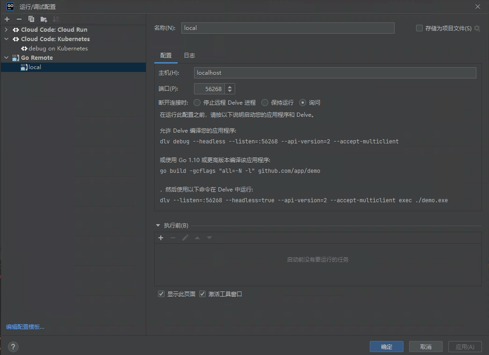

<!--more-->

## Build

Skaffold officially supports the following build methods:

- Docker — the most common
- Bazel — Google's internal open-source build system; not widely used
- Custom — run an arbitrary image to execute custom build commands
- Jib — Java-specific
- ko — Go-specific

### Docker

Here's the official example Dockerfile. It uses the Dockerfile builder pattern: compile the service inside a builder image, then copy the compiled binary into the target image.

This approach nicely shields developers from environmental differences — no need to write complex Makefiles to accommodate different environments. Just install Docker and you can fully build the project.

```yaml
FROM golang:1.18 as builder
COPY main.go .
# `skaffold debug` sets SKAFFOLD_GO_GCFLAGS to disable compiler optimizations
ARG SKAFFOLD_GO_GCFLAGS
RUN go build -gcflags="${SKAFFOLD_GO_GCFLAGS}" -o /app main.go

FROM alpine:3
# Define GOTRACEBACK to mark this container as using the Go language runtime
# for `skaffold debug` (https://skaffold.dev/docs/workflows/debug/).
ENV GOTRACEBACK=single
CMD ["./app"]
COPY --from=builder /app .
```

There are a few issues with this approach:

1. Slow builds — you need to spin up a `builder` image for compilation, which is slower than building locally.
2. You need to solve caching. Without caching, `go build` downloads all dependencies from scratch every time. Docker's newer BuildKit feature can address this: mount your local Go module cache into the image during the builder stage. See: <https://www.docker.com/blog/containerize-your-go-developer-environment-part-2/>
3. You need to add access credentials to the builder image — e.g., adding GitLab credentials for internal projects so private repos can be pulled. *Hardcoding account passwords or SSH keys directly into the Dockerfile isn't a great approach; `netrc` can help solve this.*

### ko

While building and compiling applications with Docker has many benefits, the "build locally then `docker build`" workflow is still faster.

But there's an even faster way: build locally, then skip Docker entirely and construct the image directly according to the Docker image specification. This eliminates the interaction with the Docker daemon. And since our application is relatively simple — just a single binary, no other system dependencies, no complex Dockerfile build process — optimizing around this flow shaves off even more build time. That's how ko was born. *Java's Jib follows a similar idea.*

### Official Introduction

`ko` is a fast image-building tool for Go applications. Both `ko` and `skaffold` were built by Google teams.

Its ideal use case is Go applications without specific system dependencies (e.g., CGO).

`ko` compiles the application using the local `go build` — Docker is completely unnecessary.

`ko` has plenty of other features if you're interested. `skaffold` already integrates `ko`, so as long as your local `go build` compiles the application normally, just change the `skaffold` config from `docker` to `ko` and it'll work. You barely need to understand how `ko` itself works.

```yaml
build:
  artifacts:
  - image: cr.speakin.mobi/algo_platform/algo_ability_api
    # docker:
    #   - cr.speakin.mobi/algo_platform/algo_ability_api
    ko:
      fromImage: cr.speakin.mobi/common/frolvlad/alpine-glibc:alpine-3.9
```

One thing to note: `ko` defaults to images from `gcr.io`, which requires circumventing the GFW. Use `fromImage` to switch to an accessible registry image. If your deployment image still needs certain dependencies and a complex Dockerfile, you can build the base image ahead of time and then use `ko` to integrate your application — this still speeds up image building.

## Tag

Built images need tags for versioning. The default `gitCommit` strategy uses the commit hash, which works fine for most needs.

For release versions, you can use the `inputDigest` strategy to manually specify the tag.

## Deploy

When Skaffold deploys applications to Kubernetes, it follows these steps:

- The Skaffold deployer renders Kubernetes manifests: it replaces the placeholder image name with the tagged version from the build step.
- It deploys the Kubernetes manifests to the cluster.
- It blocks and periodically checks the application status until deployment completes and the application is running stably — or until timeout/failure.

### Supported Deployment Methods

- docker
- kubectl
- kustomize
- Helm

### Helm

We use Helm because it supports templating. Suppose services A, B, and C all need to use the same MySQL instance. With Helm, you can use Go template syntax to fill in ConfigMaps, and declare MySQL info in an external `values.yaml`. This lets you centrally manage database information.

#### Our Deployment Workspace Structure

```bash
tree
├── serviceA
├── serviceB
├── serviceC
└── deployment
    ├── README.md
    ├── api
    │   ├── Chart.yaml
    │   ├── charts
    │   └── values.yaml
    ├── hosts
    ├── kubeconfig
    │   ├── new.sh
    │   ├── clusterX
    │   └── template.yaml
    └── route.yaml
```

- `serviceX` is an individual business service.
- `deployment` is where all deployment-related config is managed. Helm-related files live here.
- For development environments we use Skaffold; for staging, we use ArgoCD to monitor the deployment, implementing GitOps.

#### Helm Deployment Configuration

```yaml
deploy:
  helm:
    releases:
    - name: algo-ability-api
      namespace: ai-ability-test
      chartPath: ../deployment/api/charts/algo_ability_api
      artifactOverrides:
        image: cr.speakin.mobi/algo_platform/algo_ability_api
      imageStrategy:
        helm: {}
      setValues:
        service.type: NodePort
        service.nodeport: 31081
        debug: true
```

- `chartPath`: specifies the location of Helm deployment files.
- `setValues`: lets you override values in `values.yaml`.
- `setValues.debug`: when using `skaffold debug`, Kubernetes livenessProbe and readinessProbe should be turned off — otherwise probes will fail during breakpoint pauses. So we add a `debug` variable in the templates to control probe on/off.

```yaml
          {{- if not .Values.debug }}
          livenessProbe:
            tcpSocket:
              port: 1081
            initialDelaySeconds: 5
            periodSeconds: 10
          readinessProbe:
            tcpSocket:
              port: 1081
            initialDelaySeconds: 5
            periodSeconds: 10
          {{- end }}
```

## IDE Debugging

### GoLand

The Cloud Code plugin can automatically detect `skaffold.yaml` and create run/debug configurations. Once set up, you can debug directly with breakpoints and all the usual features.

### VSCode

Add the following to your debug configuration:

```json
{
    "configurations": [
        {
            "name": "k8s: algo-ability-api",
            "type": "cloudcode.kubernetes",
            "request": "launch",
            "skaffoldConfig": "${workspaceFolder}/skaffold.yaml",
            "watch": true,
            "cleanUp": false,
            "portForward": true,
            "imageRegistry": "cr.speakin.mobi",
            "debug": [
                {
                    "image": "cr.speakin.mobi/algo_platform/algo_ability_api",
                    "containerName": "algo-ability-api",
                    "sourceFileMap": {
                        "${workspaceFolder}": "${workspaceFolder}"
                    }
                }
            ]
        }
    ]
}
```

Note that `cleanUp` is set to `false` so the application isn't cleaned up when you stop debugging.

Both variables in `sourceFileMap` must be set to `workspaceFolder`.

If debugging still doesn't work after configuration, check the official troubleshooting docs or try the dlv approach in section 4.3:
<https://skaffold.dev/docs/workflows/debug/>
<https://github.com/GoogleContainerTools/skaffold/issues/6843>

### dlv

When I first started debugging with the two IDEs above, configuration took a long time. If you don't want to spend time on config, or if neither method works, you can just run `skaffold debug` in another terminal:

```bash
skaffold debug

Listing files to watch...
 - cr.speakin.mobi/algo_platform/algo_ability_api
Generating tags...
 - cr.speakin.mobi/algo_platform/algo_ability_api -> cr.speakin.mobi/algo_platform/algo_ability_api:14799fc-dirty
Checking cache...
 - cr.speakin.mobi/algo_platform/algo_ability_api: Found Remotely
Tags used in deployment:
 - cr.speakin.mobi/algo_platform/algo_ability_api -> cr.speakin.mobi/algo_platform/algo_ability_api:14799fc-dirty@sha256:09fde9c9c78c5f57d1356586c4c2594fea4743304c924b244447216de7766bac
Starting deploy...
WARNING: Kubernetes configuration file is group-readable. This is insecure. Location: /Users/rainfd/.kube/config
WARNING: Kubernetes configuration file is world-readable. This is insecure. Location: /Users/rainfd/.kube/config
WARNING: Kubernetes configuration file is group-readable. This is insecure. Location: /Users/rainfd/.kube/config
WARNING: Kubernetes configuration file is world-readable. This is insecure. Location: /Users/rainfd/.kube/config
Release "algo-ability-api" has been upgraded. Happy Helming!
NAME: algo-ability-api
LAST DEPLOYED: Wed Jun 22 15:42:38 2022
NAMESPACE: ai-ability-test
STATUS: deployed
REVISION: 11
Waiting for deployments to stabilize...
 - ai-ability-test:deployment/algo-ability-api is ready.
Deployments stabilized in 1.623 second
WARN[0010] Skipping the port forwarding resource deployment/algo-ability-api because namespace is not specified  subtask=-1 task=DevLoop
Press Ctrl+C to exit
Not watching for changes...
Port forwarding pod/algo-ability-api-6c84f78844-4sszc in namespace ai-ability-test, remote port 56268 -> http://127.0.0.1:56268
```

dlv's remote port is exposed to localhost on port 56268. At this point, you can use VSCode's or GoLand's remote debugging feature.

VSCode debug config:

```json
    {
        "name": "Skaffold Debug",
        "type": "go",
        "request": "attach",
        "debugAdapter": "dlv-dap",
        "mode": "remote",
        "host": "localhost",
        "port": 56268,
        "cwd": "${workspaceFolder}",
        "remotePath": "${workspaceFolder}"
    }
```

GoLand config:



## Other Configuration Options

### local.push == true

Unless you're using minikube, you'll need to push images to a registry on every build and deploy so the k8s cluster can pull the correct image.

```yaml
apiVersion: skaffold/v2beta28
kind: Config
metadata:
  name: app
build:
  artifacts:
  - image: xxx
    ko: {}
  local:
    push: true
```

### portForward

Port forwarding redirects a k8s deployment, service, or other resource port to your local port — similar to `kubectl port-forward`.

```yaml
portForward:
- resourceType: deployment
  resourceName: algo-ability-api
  address: 0.0.0.0 # default is 127.0.0.1
  port: 1081 # remote port
  localPort: 1081 # local port; if not specified, a random port is assigned each time
```

## Creating a Skaffold Project Workflow

### 1. Decide on Deployment Method

- Decide whether to deploy with kubectl or Helm.
- Once decided, reference other projects to modify Kubernetes manifests, then run `skaffold init`.

### 2. Decide on Build Method

1. Use ko for all projects without complex build processes.
2. Make sure local `go build` works normally.
3. Confirm the image push destination and make sure local push permissions are in place.
4. Debug with `skaffold build`.

### 3. Test Deployment with `skaffold run`
