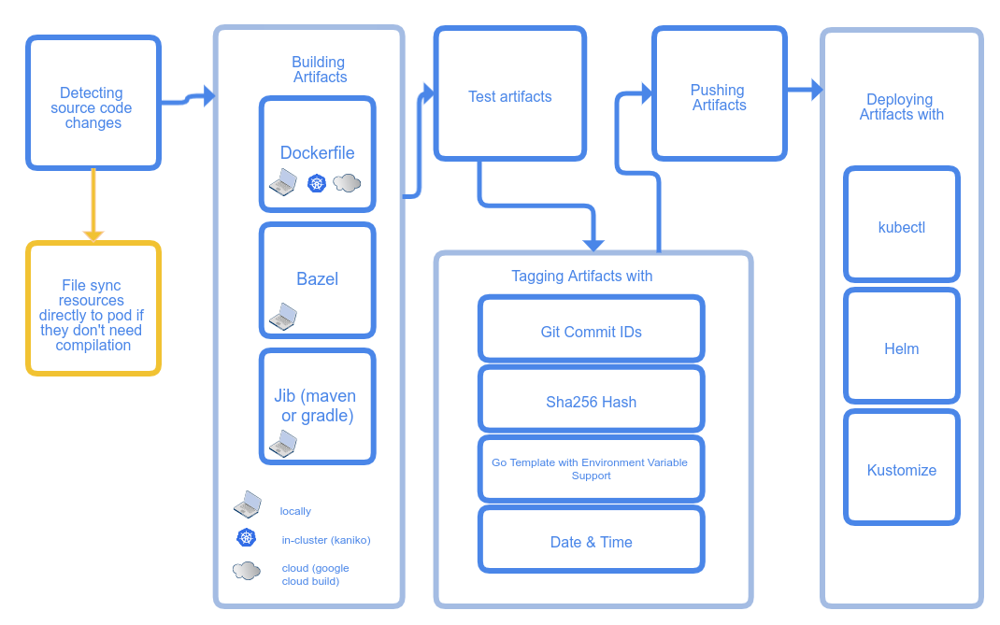

What is Skaffold? In simple terms, it's a local CI/CD tool that quickly deploys your application to a Kubernetes cluster.

Features:
- Provides a fast local Kubernetes development experience, optimizing the source-to-Kubernetes workflow
- Configure once, run anywhere
- Lightweight — just a single binary

<!--more-->

---

## Why Skaffold?

Our current CI setup uses Jenkins or GitLab CI, with Helm for deployment. Several pain points come up:

1. Even with pre-defined templates, CI/CD always has something that needs tweaking. Neither Jenkins nor GitLab offers good local debugging tools — the debugging process is both slow and painful.
2. During application testing, you often can't pinpoint issues from service responses and logs alone. You either reproduce the problem with a local dev service, or connect your local service to the test environment for debugging. Switching between environments is a hassle.

Skaffold addresses these problems head-on:

1. **Simplified CI/CD workflow.** Skaffold runs locally and has simple configuration, so the whole workflow is easy to debug. Once configured, anyone can run it with a single command.
2. **Accelerated CI/CD workflow.** The `skaffold run` command takes you from code to deployment on Kubernetes in as little as a few seconds. The old workflow required pushing code, waiting for Jenkins to detect the change, then slowly kicking off a build — at least one or two minutes, sometimes five or six.
3. **Easier deployment debugging.** Skaffold has plugins for both VS Code and GoLand, offering remote debugging that feels almost identical to local debugging.

## Getting Started

*Official Quickstart: https://skaffold.dev/docs/quickstart/*

### Installation

- Linux: [https://storage.googleapis.com/skaffold/releases/latest/skaffold-linux-amd64](https://storage.googleapis.com/skaffold/releases/latest/skaffold-linux-amd64)
- macOS: [https://storage.googleapis.com/skaffold/releases/latest/skaffold-darwin-amd64](https://storage.googleapis.com/skaffold/releases/latest/skaffold-darwin-amd64)
- Windows: [https://storage.googleapis.com/skaffold/releases/latest/skaffold-windows-amd64.exe](https://storage.googleapis.com/skaffold/releases/latest/skaffold-windows-amd64.exe)
- Docker: `docker run gcr.io/k8s-skaffold/skaffold:latest skaffold <command>`

For IDE plugins: search "Cloud Code" in VS Code, or "skaffold" in GoLand.

### Clone the Example Project

```bash
git clone --depth 1 https://github.com/GoogleContainerTools/skaffold

cd skaffold/examples/getting-started
```

Modify the image address in `skaffold.yaml` and `k8s-pod.yaml` to a registry you have push access to, e.g., your Docker Hub account: `userxxx/getting-started`. **Note: don't add a tag — Skaffold handles that automatically.**

### skaffold dev — Continuous Build and Redeploy on Code Changes

Skaffold deploys Pods to the namespace of your current kubectx by default. Switch contexts beforehand if needed, or specify the namespace in the config:

```yaml
deploy:
  kubectl:
    manifests:
      - k8s-*
    defaultNamespace: xx
```

Once deployed successfully, try modifying the "Hello world!" string — you'll see that `skaffold dev` watches for code changes and redeploys automatically.

```text
Listing files to watch...
 - skaffold-example
Generating tags...
 - skaffold-example -> skaffold-example:v1.1.0-113-g4649f2c16
Checking cache...
 - skaffold-example: Not found. Building
Found [docker-desktop] context, using local docker daemon.
Building [skaffold-example]...
Sending build context to Docker daemon  3.072kB
Step 1/6 : FROM golang:1.12.9-alpine3.10 as builder
 ---> e0d646523991
Step 2/6 : COPY main.go .
 ---> Using cache
 ---> e4788ffa88e7
Step 3/6 : RUN go build -o /app main.go
 ---> Using cache
 ---> 686396d9e9cc
Step 4/6 : FROM alpine:3.10
 ---> 965ea09ff2eb
Step 5/6 : CMD ["./app"]
 ---> Using cache
 ---> be0603b9d79e
Step 6/6 : COPY --from=builder /app .
 ---> Using cache
 ---> c827aa5a4b12
Successfully built c827aa5a4b12
Successfully tagged skaffold-example:v1.1.0-113-g4649f2c16
Tags used in deployment:
 - skaffold-example -> skaffold-example:c827aa5a4b12e707163842b803d666eda11b8ec20c7a480198960cfdcb251042
   local images can't be referenced by digest. They are tagged and referenced by a unique ID instead
Starting deploy...
 - pod/getting-started created
Watching for changes...
[getting-started] Hello world!
[getting-started] Hello world!
[getting-started] Hello world!

Listing files to watch...
 - skaffold-example
Generating tags...
 - skaffold-example -> skaffold-example:v1.1.0-113-g4649f2c16
Checking cache...
 - skaffold-example: Not found. Building
Found [docker-desktop] context, using local docker daemon.
Building [skaffold-example]...
Sending build context to Docker daemon  3.072kB
Step 1/6 : FROM golang:1.12.9-alpine3.10 as builder
 ---> e0d646523991
Step 2/6 : COPY main.go .
 ---> Using cache
 ---> e4788ffa88e7
Step 3/6 : RUN go build -o /app main.go
 ---> Using cache
 ---> 686396d9e9cc
Step 4/6 : FROM alpine:3.10
 ---> 965ea09ff2eb
Step 5/6 : CMD ["./app"]
 ---> Using cache
 ---> be0603b9d79e
Step 6/6 : COPY --from=builder /app .
 ---> Using cache
 ---> c827aa5a4b12
Successfully built c827aa5a4b12
Successfully tagged skaffold-example:v1.1.0-113-g4649f2c16
Tags used in deployment:
 - skaffold-example -> skaffold-example:c827aa5a4b12e707163842b803d666eda11b8ec20c7a480198960cfdcb251042
   local images can't be referenced by digest. They are tagged and referenced by a unique ID instead
Starting deploy...
 - pod/getting-started created
Watching for changes...
[getting-started] Hello world!
[getting-started] Hello world!
[getting-started] Hello world!
```

### skaffold run — Deploy Directly

Unlike `skaffold dev`, `skaffold run` deploys the application directly — use it when you're done debugging and want to deploy the full application.

## Skaffold Architecture



The overall flow has three stages: build, tag, and deploy. Each stage can be configured with different plugins.

The example project uses a `Dockerfile` to compile Go code and build an image, tags images with `gitCommit`, and deploys to Kubernetes with `kubectl`.

For our company's projects, builds primarily use `Dockerfile` and `ko`, tags default to `gitCommit`, and deployment uses `kubectl` or `helm`.

## Similar Tools

Kubernetes has been around for a while, and developing applications on Kubernetes comes with its own set of problems — Skaffold isn't the only answer.

Similar tools include tilt, DevSpace, okteto, and Nocalhost.

### Nocalhost

One worth highlighting is Nocalhost.

For interpreted languages, tools like Skaffold support file sync — syncing code changes directly to the target container.

For compiled languages, that's not an option — you have to compile, rebuild images, and push. Nocalhost takes a different approach: it replaces the target container with a development container, syncs your code into it, and does the compilation inside. A clever approach — I'll give it a proper try when I have time.

### Telepresence

Early in the development workflow, you might not have Kubernetes manifests and other resources configured yet. How do you run your application in a Kubernetes environment? Telepresence is a great solution. Think of it as a Kubernetes-native VPN — turn it on and you can access the Kubernetes network locally, using internal DNS names to reach other Kubernetes services.
