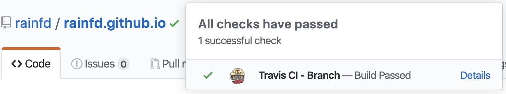
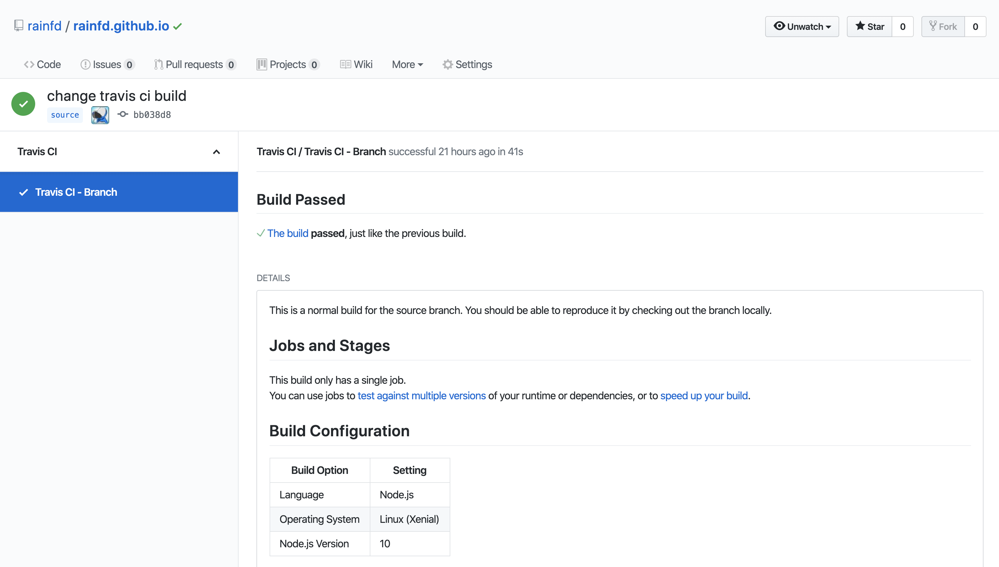
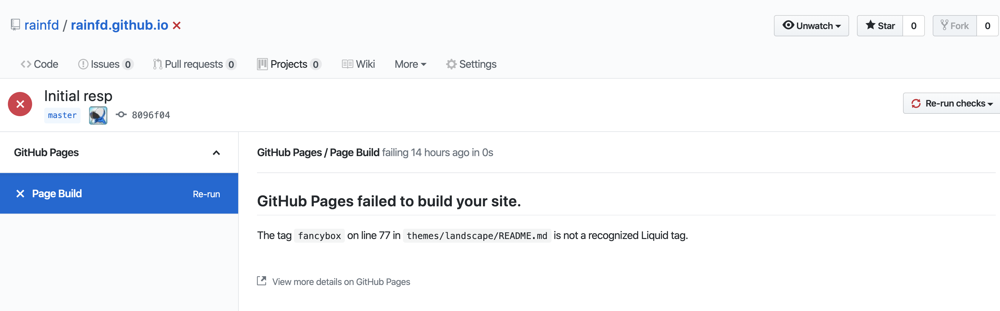

<!--more-->

## GitHub Pages

GitHub Pages comes in two flavors: personal pages and project pages.

- **Personal page**: domain is `username.github.io`, where `username` matches your GitHub username. Only the master branch of the repo can be used to build the page.
- **Project page**: domain is `username.github.io/project`, where `project` is the repo name. You can designate any branch as the build source.

*The deployment instructions below only cover personal pages. If you've set up a personal page before, project pages shouldn't be a challenge.*

## Travis CI

GitHub has been using Travis CI for automated builds for a long time. After a certain update, GitHub started showing Travis CI build results directly on the platform.



Here, we can push the blog's source code to GitHub, then trigger Travis CI to push the built result to the master branch of my personal page repo at `rainfd.github.io`.

*Note: push your source code to a non-master branch, since personal pages can only use the master branch for GitHub Pages.*

## Deployment Steps

1. Create a repo on GitHub named **username.github.io**.
2. Add a `.gitignore` to your Hexo blog code, excluding generated static files and other irrelevant files. You can reference the file below.

  ```plain
  db.json
  *.log
  node_modules/
  public/
  .deploy*/%
  ```

3. If you're like me and want to keep third-party themes in sync with upstream, fork the theme and add it as a submodule in your blog code.

```bash
git submodule add $url themes/your_theme
```

4. Sign up for [Travis CI](https://github.com/marketplace/travis-ci) and authorize it.
5. In [Applications settings](https://github.com/settings/installations), configure Travis CI to grant access to your `username.github.io` repo.
6. After configuration, you'll be redirected to the Travis CI page.
7. Create a new [Token](https://github.com/settings/tokens) on GitHub with at least all repo-level permissions.
8. Go back to the Travis CI page (or re-login), and set the token you just created as the environment variable **GH_TOKEN** on the corresponding Travis repo. Remember to save.

[Travis_env](./assets/travis_env.png)

9. Add the `.travis.yml` config file to your blog code (I use the `source` branch to store source code).

```yaml
sudo: false
language: node_js
node_js:
  - 10 # use nodejs v10 LTS
cache: npm
branches:
  only: # only trigger builds when these branches change
    - source # build master branch only
script:
  - hexo generate # generate static files
deploy:
  provider: pages
  skip-cleanup: true
  github-token: $GH_TOKEN
  keep-history: true
  on: # which branch to build from
    branch: source
  target_branch: master # target branch for deployment, defaults to gh-pages
  local-dir: public # deployment target directory
```

> Hexo's Travis CI deployment guide: <https://hexo.io/docs/github-pages>
> Travis CI GitHub Pages deployment config reference: <https://docs.travis-ci.com/user/deployment/pages/>

11. This is for cases where your blog code also contains the original theme.
12. Push the code to the branch where you store your source (**remember: it cannot be the master branch**).
13. Wait for the Travis build to finish. You can also click the icon next to the project name to view build progress.

14. If the build fails for the following reason, delete line 77 of the corresponding file (because GitHub Pages uses Jekyll as its default build template, and the syntax on line 77 conflicts with Jekyll's syntax).

15. Finally, visit `username.github.io` to check your blog.
