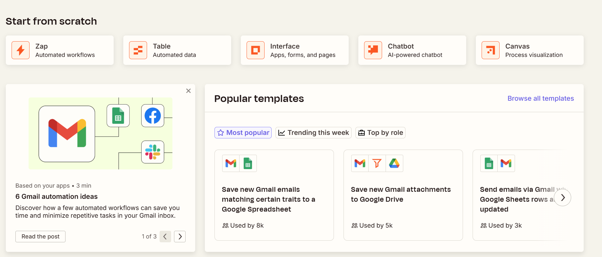

Lately there's a new concept making waves in LLM agent development: MCP, short for [Model Context Protocol](https://modelcontextprotocol.io/introduction). The official explanation describes it as a USB-C-like protocol that lets various data sources and tools connect to LLM applications through a standardized interface. The idea is to unify the spec so that adding new capabilities to LLM applications becomes much easier.

<!--more-->

## MCP Architecture

MCP's architecture is a straightforward client-server model. Various capabilities are encapsulated within MCP Servers, the LLM application acts as the Host, and the Host uses an MCP Client internally to interact with MCP Servers.


## Protocol Details

A quick overview:

- Transport:
  - Local: standard input/output
  - HTTP
  - All content uses the JSON-RPC 2.0 format

- Message Types:
  - Request
  - Result
  - Errors
  - Notification — one-way message, no response required

- Server Capabilities:
  - Resources — file contents, database queries, etc.
  - Prompts
  - Tools — local CLI tools, third-party API calls, etc.

The protocol core is very simple and easy to implement. What matters are the server capabilities. Here's an example using the Python SDK:

```
import sqlite3

from mcp.server.fastmcp import FastMCP

mcp = FastMCP("Explorer")

@mcp.resource("schema://main")
def get_schema() -> str:
    """Provide the database schema as a resource"""
    conn = sqlite3.connect("database.db")
    schema = conn.execute("SELECT sql FROM sqlite_master WHERE type='table'").fetchall()
    return "\n".join(sql[0] for sql in schema if sql[0])
    
@mcp.tool()
def echo_tool(message: str) -> str:
    """Echo a message as a tool"""
    return f"Tool echo: {message}"

@mcp.prompt()
def echo_prompt(message: str) -> str:
    """Create an echo prompt"""
    return f"Please process this message: {message}"
```

Resources are described via `[protocol]://[host]/[path]` URIs, giving upper-layer applications a more intuitive interface compared to direct file or database access.

## Why Do We Need MCP?

At this point, you have a rough idea of what MCP is. The real question: why do we need it?

Think about how LLM applications are developed without MCP. Say you're using LangChain — you need to plan the entire calling workflow, integrate vector databases, and wire up all sorts of tools and third-party services. With MCP, these databases, services, and tools can all be standardized under the MCP umbrella. When you build another LLM application using a different framework or language, you can directly connect to the same MCP Servers.

Some might argue: LangChain already supports tons of third-party services, and once you've committed to LangChain, you're not likely to switch frameworks. New applications reuse old code anyway — isn't switching to MCP just extra work for nothing?

If you're an average application developer, that's not an unreasonable take. MCP doesn't solve any critical pain points here, nor does it introduce any unique capabilities. Whatever an LLM app could do before, it can still do with MCP. I came across an article, [Notes on MCP](https://taoofmac.com/space/notes/2025/03/22/1900), that shares a similar view. Plus, MCP Servers require running an additional server process, which adds maintenance overhead.

## The MCP Ecosystem

MCP has only been hot for a few months, and the protocol itself is still evolving. I haven't seen any standout use cases or revolutionary applications yet, but we can observe how the MCP ecosystem is developing and what concrete applications are emerging.

**MCP Community**

[mcpflow](https://mcpflow.io/) — there are many community platforms like this, essentially MCP versions of API marketplaces.

**Automation Tools**



[zapier](https://zapier.com/app/home) chains common applications together through automation tools. Adding LLM and MCP support for more services could enrich certain scenarios.

**Plugins**

Editors like Cursor, Windsurf, and IntelliJ IDEA all support MCP. It's easy to imagine many future plugins being implemented via MCP, making them universally compatible across all editors. For example, a plugin that generates commit messages from staged code — as long as the MCP input is defined as "the code in this commit," most of the plugin's functionality becomes editor-agnostic.

Beyond these scenarios, another one that comes to mind: third-party API services implementing MCP Servers so users' LLM applications can connect to them easily.

# Conclusion

To give a very rough conclusion: if you're not developing a large number of heterogeneous LLM applications, and you don't provide API-like services, you can probably ignore MCP in your day-to-day work.

That said, this protocol is evolving incredibly fast — it's worth keeping some expectations. At minimum, imagine what happens when editors like Cursor support a rich set of practical MCP servers. Could it take our workflows to the next level of intelligence?
