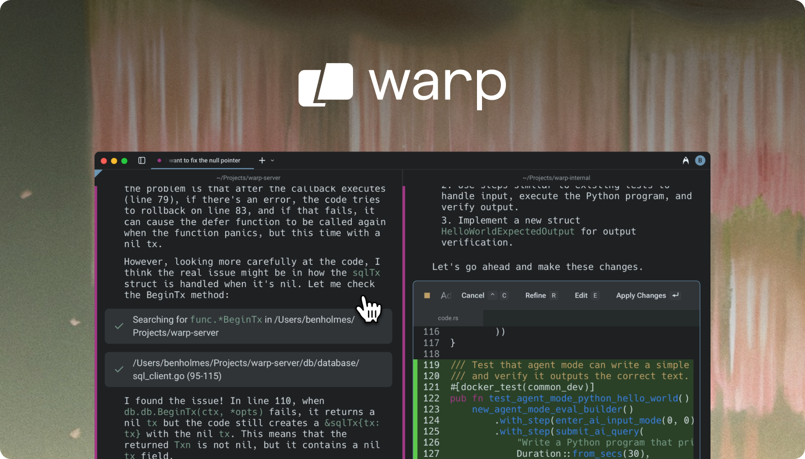
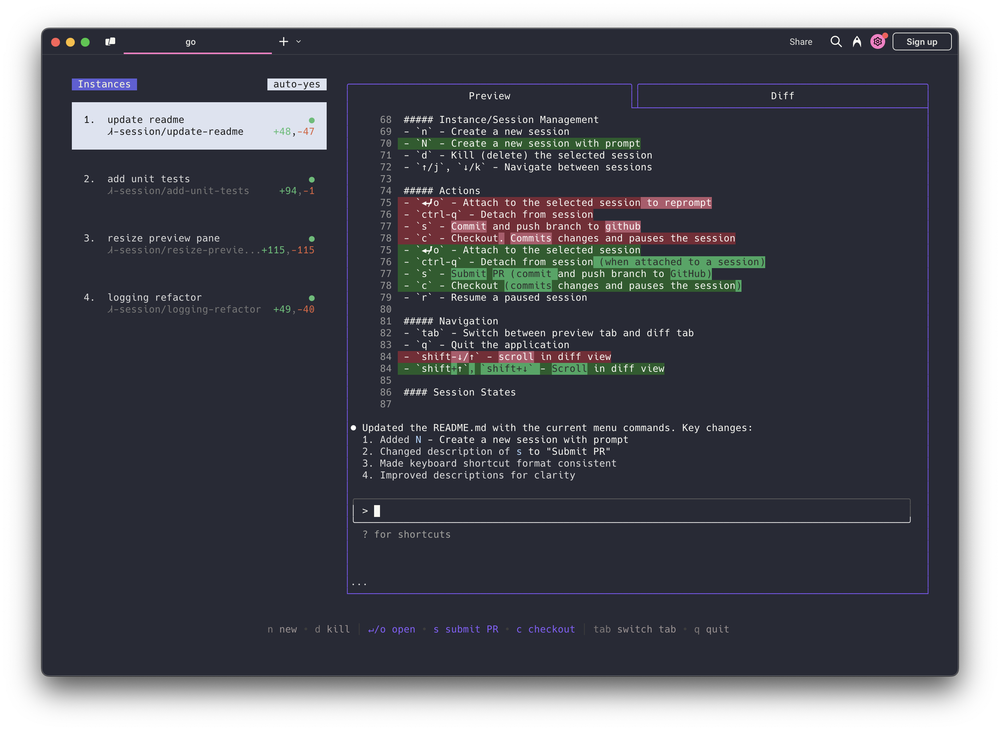
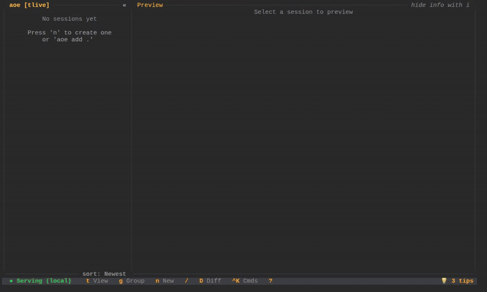
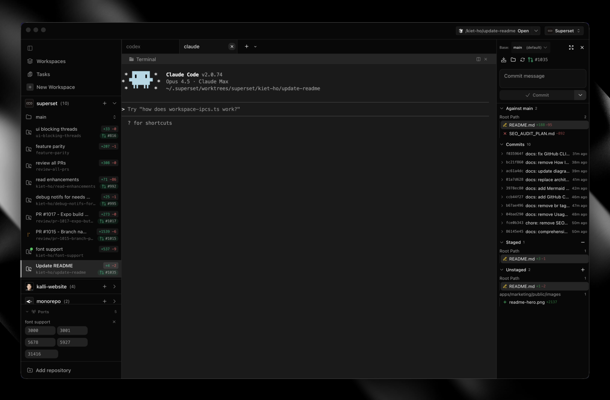
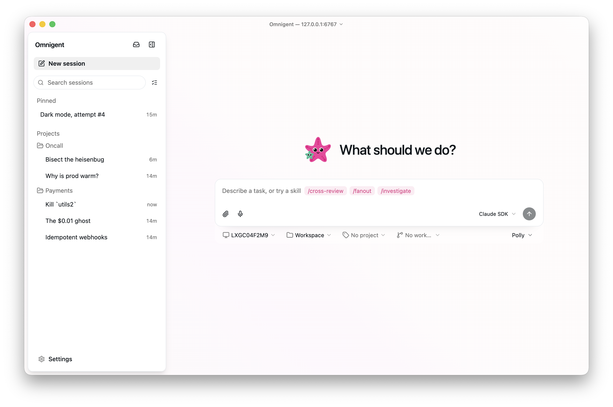

如果你同时在用 Claude Code、Codex、Gemini CLI、OpenCode 这些终端 AI agent，你不会只打开一个。你会开好几个 terminal tab，同时让它们干不同的活。干着干着就乱了——哪个 agent 在做什么？谁改了哪个文件？冲突了怎么办？

这就是「多 Agent 管理工具」要解决的问题。这半年冒出来不少，我按功能层次把它们分成四类。

## Agent 终端：把 agent 管理直接做进终端里

这类工具的起点是终端本身，在终端里内置了 agent 管理能力——不是一个插件或叠加层，而是从底层就为 AI agent 设计的。

### Warp — 从终端长出来的 agentic 环境

[Warp](https://github.com/warpdotdev/warp)（62,726 stars）自称 "agentic development environment, born out of the terminal"。从一个现代化终端起步，演变成了完整的 AI 开发环境。内置 Agent Mode，直接在终端里跟 AI agent 交互。它的思路是「终端本身就是 agent」——不是终端里跑 agent，而是终端即 agent。Warp 部分闭源，但终端核心开源。

### cmux — 基于 Ghostty 的 AI agent 终端

[cmux](https://github.com/manaflow-ai/cmux)（23,408 stars）基于 [Ghostty](https://github.com/ghostty-org/ghostty)（57,469 stars，Zig 写的极致性能终端模拟器）构建，专门为 AI coding agent 设计。垂直 tab、通知系统、agent 任务完成时推送通知、内建浏览器。你可以在同一个窗口里管理多个 agent session，agent 跑完了你不用盯着屏幕等。

跟 Warp 比：Warp 的野心更大——它要成为完整的开发环境；cmux 更聚焦，做一个对 AI agent 友好的终端。Wave 则偏向把各种工具集成进终端，不只是 agent 管理。Ghostty 是 cmux 的底层引擎，但它本身不带 agent 管理功能，是纯粹的高性能终端模拟器。

### Wave Terminal — 开源跨平台 AI 终端

[Wave Terminal](https://github.com/wavetermdev/waveterm)（21,516 stars）是另一个开源 AI 集成终端，跨平台（macOS/Linux/Windows），内置 AI 工作流、图形渲染、文件预览。跟 Warp 和 cmux 比，Wave 更强调「在一个终端里完成所有事」——不只是 agent，还有数据可视化、SSH 管理、网页预览。

## Session Manager：在现有终端里管理多个 agent 会话

跟上一类的区别：这些工具不绑定特定终端，你在 iTerm、Alacritty、甚至 Warp 里都能用它们。核心是「在终端里开多个 agent，管好它们」。

跟下面「Agentic IDE」的区别：Session Manager 活在终端里，TUI 或 tmux 就是它的界面；Agentic IDE 是独立的 GUI 应用，长得像传统编辑器。

### herdr — agent multiplexer

[herdr](https://github.com/ogulcancelik/herdr)（10,006 stars）定位最像传统 tmux——在一个终端窗口里管理多个 agent，每个 agent 跑在独立的工作区。不绑定终端，你用什么都行。

### claude-squad — tmux 上的 agent 团队

[claude-squad](https://github.com/smtg-ai/claude-squad)（7,997 stars）用 tmux 管理多个 AI agent（Claude Code、Codex、OpenCode、Amp）。如果你已经在用 tmux，这个最自然——它不引入新的 UI 层，直接在 tmux 里分 pane 跑 agent。

### ccmanager — 支持的 agent 类型最多

[ccmanager](https://github.com/kbwo/ccmanager)（1,173 stars）支持 Claude Code、Gemini CLI、Codex、Cursor、Copilot、Cline、OpenCode、Kimi CLI 八种 agent。一个 TUI 里切换，不用记哪个 agent 跑在哪个 tab。

### agent-of-empires — TUI + Web 双界面

[agent-of-empires](https://github.com/agent-of-empires/agent-of-empires)（2,721 stars）Rust 写的，用 tmux + git worktree 隔离 agent，支持 Claude Code、OpenCode、Codex、Gemini CLI、Copilot CLI、Pi.dev 等。提供 TUI 和 Web 两种界面，手机上也能管理。

HN 上 118 points、44 条评论，社区评价最高。跟 ccmanager 的区别：agent-of-empires 更偏「让多个 agent 并行干活不打架」，ccmanager 更偏「管理多种不同 agent 的会话」。

herdr 最像通用 multiplexer，claude-squad 是 tmux 用户的自然延伸，ccmanager 支持的 agent 类型最明确（8 种），agent-of-empires 的 worktree 隔离做得最好，还有手机端。

## Agentic IDE：编辑器形态的 agent 管理

这类工具长得像 IDE，但内核是 agent 管理。不是你写代码 AI 辅助，而是 AI agent 写代码你 review。

### Superset — 给 AI agent 时代做的代码编辑器

[Superset](https://github.com/superset-sh/superset)（12,215 stars）自称 "Code Editor for the AI Agents Era"。GUI 编辑器形态，专门为同时跑多个 AI agent 设计。支持 Claude Code、Codex、Amp Code、Cursor Agent。不同 tab 管理不同 agent session，界面更像传统 IDE，但工作流是「agent 写、你审」。

### Conductor — Superset 的最大竞品

[Conductor](https://conductor.build) 是一个 macOS 桌面应用，在隔离的 git worktree 中并行运行 Claude Code、Codex、Cursor 等 agent，提供统一仪表盘监控、代码审查和合并功能。HN 上 228 points（[Show HN](https://news.ycombinator.com/item?id=44594584)），115 条评论。闭源商业产品，由 Melty Labs 开发。

跟 Superset 的差异：Superset 开源（GitHub 可见），Conductor 闭源商业产品；HN 用户 motoboi 总结「superset is terminal-centric while conductor is chat-centric」——Superset 更像编辑器，Conductor 更像聊天 + 看板。

### stagewise — 开源 Agentic IDE

[stagewise](https://github.com/stagewise-io/stagewise)（6,713 stars）同样定位 Agentic IDE，内置 agent 编排、app 预览、git 工作流。跟 Superset 比更偏编排和工作流自动化，Superset 更偏编辑器体验。

## Orchestrator：一个任务拆给多个 agent 干

这层逻辑不一样：不是「帮你管 agent」，而是「agent 帮你干活」。你给一个任务，编排器拆成子任务、分发给不同 agent、收集结果。

### ruflo — 62k stars 的 meta-harness

[ruflo](https://github.com/ruvnet/ruflo)（62,552 stars）是目前这个品类 star 最高的项目。不管底层是 Claude Code、Codex 还是 Hermes，它在上面加编排层和自适应记忆。star 多说明大家认可这个方向，但 star 多不等于好用。

### oh-my-claudecode — Claude Code 专属编排

[oh-my-claudecode](https://github.com/Yeachan-Heo/oh-my-claudecode)（37,308 stars）只做 Claude Code 的团队级并行编排。如果你只用 Claude Code，比 ruflo 更聚焦。

### agent-orchestrator — 自动处理 CI 和 merge conflict

[agent-orchestrator](https://github.com/AgentWrapper/agent-orchestrator)（7,868 stars）偏工程流程：并行 agent 编排，自动 CI 修复、merge conflict、code review。适合把 agent 嵌入 CI/CD。

### omnigent — 多 agent 无痛切换

[omnigent](https://github.com/omnigent-ai/omnigent)（6,001 stars）支持 Claude Code、Codex、Cursor、Pi。卖点是「无痛切换 harness」——今天用 Claude Code，明天换 Codex，不用改编排层代码。

### 其他

- [paseo](https://github.com/getpaseo/paseo)（9,627 stars）—— 桌面 + 移动端多 agent 编排
- [sandcastle](https://github.com/mattpocock/sandcastle)（6,583 stars）—— Matt Pocock 做的，`sandcastle.run()` 一键启动沙箱
- [1code](https://github.com/21st-dev/1code)（5,628 stars）—— Claude Code/Codex 编排层

## 社区在争论什么

HN 和中文社区的讨论里反复出现几个争论点。

**编排 vs 等更强模型。** 有人认为编排工具是过渡品——更强的模型会碾压一切编排带来的增益。HN 用户 [mordymoop](https://news.ycombinator.com/item?id=44594584) 说：「模型本身的智能提升最终会碾压任何 orchestrator 带来的能力增益。」反方观点是：用便宜模型编排可以接近甚至超过旗舰模型的成功率。掘金作者米小虾的[实测](https://juejin.cn/post/7652581847890165786)中，3 个 Sonnet 编排比单个 Opus 成本更低、成功率更高——但这里用的模型不同，节省的成本到底是编排贡献的还是模型能力差异贡献的，严格说分不开。不过大方向是对的：编排 + 便宜模型 vs 单打旗舰模型，前者大概率更划算。

**并行真的有效吗？** HN 用户 [deepdarkforest](https://news.ycombinator.com/item?id=44533339) 说：「I tried every single coding agent... whenever I try to parallelize, they clash while editing files simultaneously... It's chaos.」几乎所有成功方案都指向同一个解法：git worktree 隔离 + test gating。没有隔离的并行等于自找麻烦。

**代码质量 vs 吞吐量。** [px1999](https://news.ycombinator.com/item?id=46748579)（HN）说到了一个真问题：「Few people focus on building high quality changes vs maximising throughput of low quality work items.」多 agent 工具都在强调「同时跑 N 个 agent」，但产出多不等于产出好。

双方各有道理——编排确实能省钱提效，但前提是隔离 + review 做到位，否则并行就是加速制造混乱。这不是二选一的问题，是执行层面的工程问题。

---

我目前的使用场景是同时管理多个 Pi Agent 和 Hermes Agent。macOS 上用 cmux 作为终端，Windows 上用 Warp，正在考虑用 herdr 替代现有方案。
